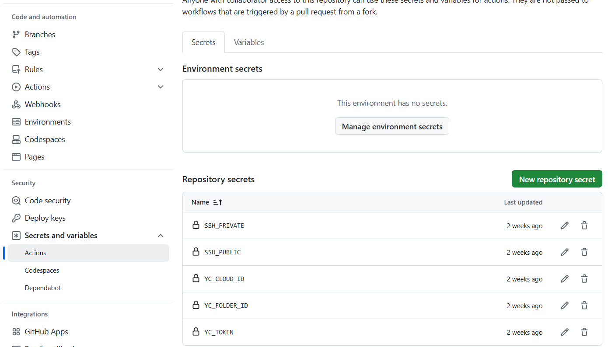
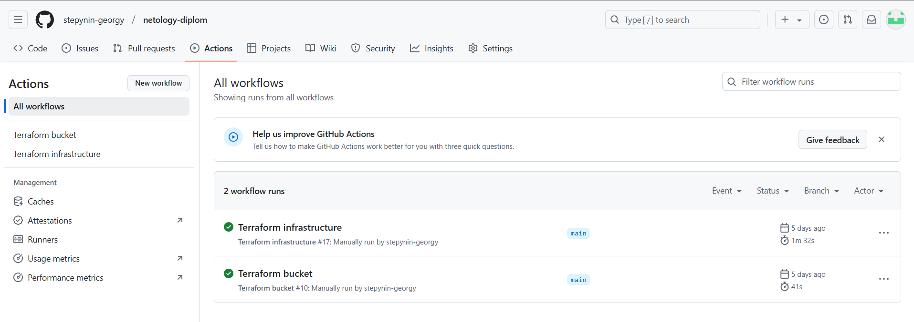
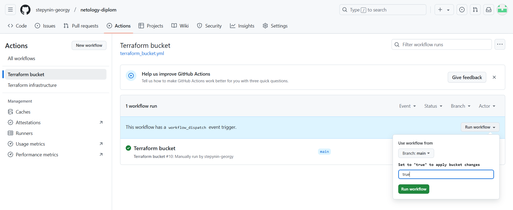
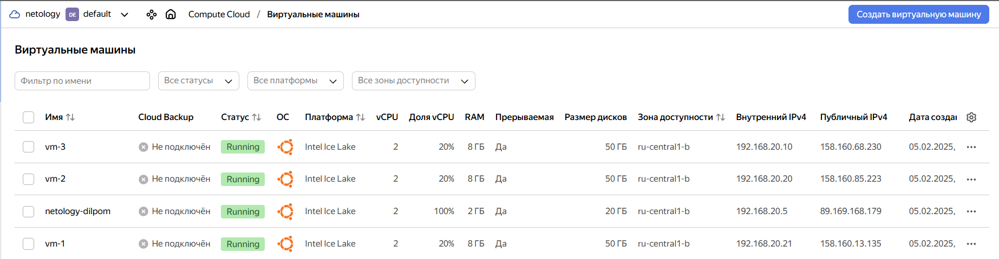
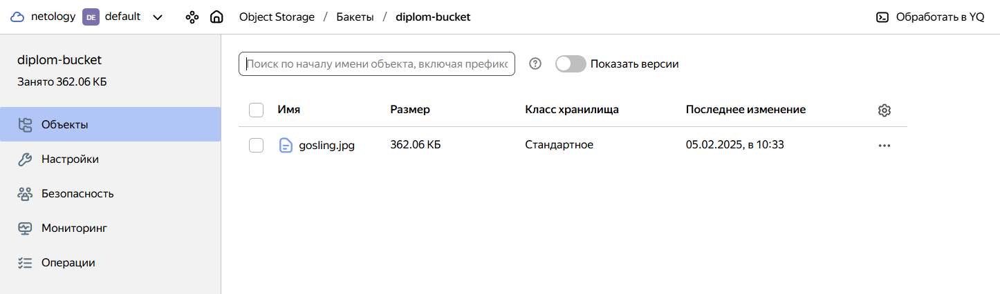

# Дипломный практикум в Yandex.Cloud
  * [Цели:](#цели)
  * [Этапы выполнения:](#этапы-выполнения)
     * [Создание облачной инфраструктуры](#создание-облачной-инфраструктуры)
     * [Создание Kubernetes кластера](#создание-kubernetes-кластера)
     * [Создание тестового приложения](#создание-тестового-приложения)
     * [Подготовка cистемы мониторинга и деплой приложения](#подготовка-cистемы-мониторинга-и-деплой-приложения)
     * [Установка и настройка CI/CD](#установка-и-настройка-cicd)
  * [Что необходимо для сдачи задания?](#что-необходимо-для-сдачи-задания)
  * [Как правильно задавать вопросы дипломному руководителю?](#как-правильно-задавать-вопросы-дипломному-руководителю)

**Перед началом работы над дипломным заданием изучите [Инструкция по экономии облачных ресурсов](https://github.com/netology-code/devops-materials/blob/master/cloudwork.MD).**

---
## Цели:

1. Подготовить облачную инфраструктуру на базе облачного провайдера Яндекс.Облако.
2. Запустить и сконфигурировать Kubernetes кластер.
3. Установить и настроить систему мониторинга.
4. Настроить и автоматизировать сборку тестового приложения с использованием Docker-контейнеров.
5. Настроить CI для автоматической сборки и тестирования.
6. Настроить CD для автоматического развёртывания приложения.

---
## Этапы выполнения:


### Создание облачной инфраструктуры

Для начала необходимо подготовить облачную инфраструктуру в ЯО при помощи [Terraform](https://www.terraform.io/).

Особенности выполнения:

- Бюджет купона ограничен, что следует иметь в виду при проектировании инфраструктуры и использовании ресурсов;
Для облачного k8s используйте региональный мастер(неотказоустойчивый). Для self-hosted k8s минимизируйте ресурсы ВМ и долю ЦПУ. В обоих вариантах используйте прерываемые ВМ для worker nodes.

Предварительная подготовка к установке и запуску Kubernetes кластера.

1. Создайте сервисный аккаунт, который будет в дальнейшем использоваться Terraform для работы с инфраструктурой с необходимыми и достаточными правами. Не стоит использовать права суперпользователя
2. Подготовьте [backend](https://developer.hashicorp.com/terraform/language/backend) для Terraform:  
   а. Рекомендуемый вариант: S3 bucket в созданном ЯО аккаунте(создание бакета через TF)
   б. Альтернативный вариант:  [Terraform Cloud](https://app.terraform.io/)
3. Создайте конфигурацию Terrafrom, используя созданный бакет ранее как бекенд для хранения стейт файла. Конфигурации Terraform для создания сервисного аккаунта и бакета и основной инфраструктуры следует сохранить в разных папках.
4. Создайте VPC с подсетями в разных зонах доступности.
5. Убедитесь, что теперь вы можете выполнить команды `terraform destroy` и `terraform apply` без дополнительных ручных действий.
6. В случае использования [Terraform Cloud](https://app.terraform.io/) в качестве [backend](https://developer.hashicorp.com/terraform/language/backend) убедитесь, что применение изменений успешно проходит, используя web-интерфейс Terraform cloud.

Ожидаемые результаты:

1. Terraform сконфигурирован и создание инфраструктуры посредством Terraform возможно без дополнительных ручных действий, стейт основной конфигурации сохраняется в бакете или Terraform Cloud
2. Полученная конфигурация инфраструктуры является предварительной, поэтому в ходе дальнейшего выполнения задания возможны изменения.

## Решение. Создание облачной инфраструктуры

Конфигурация terraform: 

[provider.tf](stepynin-georgy/netology-diplom/terraform_infrastructure/provider.tf):

<details><summary> Листинг provider.tf</summary>

```
terraform {
  required_providers {
    yandex = {
      source = "yandex-cloud/yandex"
    }
  }
  required_version = ">= 0.13"
}

provider "yandex" {
  token     = var.token
  cloud_id  = var.cloud_id
  folder_id = var.folder_id
  zone      = var.default_zone_b
}
```

</details>

[main.tf](stepynin-georgy/netology-diplom/terraform_bucket/main.tf):

<details><summary>Листинг main.tf</summary>

```
resource "yandex_storage_bucket" "diplom-bucket" {
  access_key = yandex_iam_service_account_static_access_key.service-account-static-key.access_key
  secret_key = yandex_iam_service_account_static_access_key.service-account-static-key.secret_key
  bucket     = "diplom-bucket"
  acl    = "public-read"
  website {
    index_document = "gosling.jpg"
  }
}
```

</details>

[variables.tf](stepynin-georgy/netology-diplom/terraform_bucket/variables.tf):

<details><summary>Листинг variables.tf</summary>

```
variable "default_zone_a" {
  type        = string
  default     = "ru-central1-a"
  description = "https://cloud.yandex.ru/docs/overview/concepts/geo-scope"
}

variable "default_zone_b" {
  type        = string
  default     = "ru-central1-b"
  description = "https://cloud.yandex.ru/docs/overview/concepts/geo-scope"
}

variable "default_zone_d" {
  type        = string
  default     = "ru-central1-d"
  description = "https://cloud.yandex.ru/docs/overview/concepts/geo-scope"
}

variable "vm_resources" { 
  type         = map(map(number))
  default      = {
    nat_res = {
      cores = 2
      memory = 8
      core_fraction = 20
      disk_size = 50
    }
  }
}

variable "token" {
  type        = string
  description = "OAuth-token; https://cloud.yandex.ru/docs/iam/concepts/authorization/oauth-token"
}

variable "cloud_id" {
  type        = string
  default     = "b1gpidh9fbq31fqojvmu"
  description = "https://cloud.yandex.ru/docs/resource-manager/operations/cloud/get-id"
}

variable "folder_id" {
  type        = string
  default     = "b1gbaccuaasnld9i4p6h"
  description = "https://cloud.yandex.ru/docs/resource-manager/operations/folder/get-id"
}

variable "ssh_public" {
  type        = string
  description = "https://cloud.yandex.ru/docs/resource-manager/operations/folder/get-id"
}
```

</details>

[permission_account.tf](stepynin-georgy/netology-diplom/terraform_bucket/permission_account.tf)

<details><summary>Листинг premission_account.tf</summary>

```
resource "yandex_iam_service_account" "service-account" {
  folder_id = var.folder_id
  name      = "terraform-service-account"
}

resource "yandex_resourcemanager_folder_iam_member" "service-account-editor" {
  folder_id = var.folder_id
  role      = "editor"
  member    = "serviceAccount:${yandex_iam_service_account.service-account.id}"
}

resource "yandex_iam_service_account_static_access_key" "service-account-static-key" {
  service_account_id = yandex_iam_service_account.service-account.id
}

resource "yandex_kms_symmetric_key" "key" {
  name              = "service-key"
  default_algorithm = "AES_128"
  rotation_period   = "8760h"
}
```

</details>

[infrastructure.tf](terraform_infrastructure/infrastructure.tf)

<details><summary>Листинг infrastructure.tf</summary>

```
resource "yandex_storage_object" "picture" {
  bucket = "diplom-bucket"
  key    = "gosling.jpg"
  source = "./img/gosling.jpg"
  tags = {
    test = "value"
  }
}

resource "yandex_vpc_network" "diplom-network" {
  name = local.network_name
}

resource "yandex_vpc_subnet" "public-a" {
  name           = local.subnet_name_a
  zone           = var.default_zone_a
  network_id     = yandex_vpc_network.diplom-network.id
  v4_cidr_blocks = ["192.168.10.0/24"]
}

resource "yandex_vpc_subnet" "public-b" {
  name           = local.subnet_name_b
  zone           = var.default_zone_b
  network_id     = yandex_vpc_network.diplom-network.id
  v4_cidr_blocks = ["192.168.20.0/24"]
}

resource "yandex_vpc_subnet" "public-d" {
  name           = local.subnet_name_d
  zone           = var.default_zone_d
  network_id     = yandex_vpc_network.diplom-network.id
  v4_cidr_blocks = ["192.168.30.0/24"]
}
```

</details>

[locals.tf](terraform_infrastructure/locals.tf)

<details><summary>Листинг locals.tf</summary>

```
locals {
  network_name     = "diplom-network"
  subnet_name1     = "public-subnet"
  subnet_name_a    = "public-a-subnet"
  subnet_name_b    = "public-b-subnet"
  subnet_name_d    = "public-d-subnet"
  disk1_name       = "vm-disk-public"
  vm_lamp_name     = "vm-lamp"
  platform_id      = "standard-v3"
  image_id         = "fd827b91d99psvq5fjit"
  vm_name          = "vm-1"
}
```

</details>

[variables.tf](terraform_infrastructure/variables.tf)

<details><summary>Листинг variables.tf</summary>

```
variable "default_zone_a" {
  type        = string
  default     = "ru-central1-a"
  description = "https://cloud.yandex.ru/docs/overview/concepts/geo-scope"
}

variable "default_zone_b" {
  type        = string
  default     = "ru-central1-b"
  description = "https://cloud.yandex.ru/docs/overview/concepts/geo-scope"
}

variable "default_zone_d" {
  type        = string
  default     = "ru-central1-d"
  description = "https://cloud.yandex.ru/docs/overview/concepts/geo-scope"
}

variable "vm_resources" { 
  type         = map(map(number))
  default      = {
    nat_res = {
      cores = 2
      memory = 8
      core_fraction = 20
      disk_size = 50
    }
  }
}

variable "token" {
  type        = string
  description = "OAuth-token; https://cloud.yandex.ru/docs/iam/concepts/authorization/oauth-token"
}

variable "cloud_id" {
  type        = string
  default     = "b1gpidh9fbq31fqojvmu"
  description = "https://cloud.yandex.ru/docs/resource-manager/operations/cloud/get-id"
}

variable "folder_id" {
  type        = string
  default     = "b1gbaccuaasnld9i4p6h"
  description = "https://cloud.yandex.ru/docs/resource-manager/operations/folder/get-id"
}

variable "ssh_public" {
  type        = string
  description = "https://cloud.yandex.ru/docs/resource-manager/operations/folder/get-id"
}

```
</details>

Для развертывания инфраструктуры был выбран Github Action. Для этого была создана папка .github/workflows/, а в ней два файла: [terraform-bucket.yml](stepynin-georgy/netology-diplom/.github/workflows/terraform_bucket.yml) - для развертывания бакета и сервисного аккаунта, [terraform-infrastructure.yml](stepynin-georgy/netology-diplom/.github/workflows/terraform_infrastructure.yml) - для развертывания остальной инфраструктуры (ВМ, сети, подсети и пр.).

</details>

<details><summary>Листинг terraform_bucket.yml</summary>

```
name: 'Terraform bucket'

on:
  pull_request:
    branches:
      - main
    paths:
      - 'terraform_bucket/**'
  workflow_dispatch:
    inputs:
      apply:
        description: 'Set to "true" to apply bucket changes'
        required: false
        default: 'false'

jobs:
  terraform:
    name: 'Terraform'
    runs-on: ubuntu-latest

    env:
      TOKEN: ${{ secrets.YC_TOKEN }}
      CLOUD_ID: ${{ secrets.YC_CLOUD_ID }}
      FOLDER_ID: ${{ secrets.YC_FOLDER_ID }}
      SSH_PUBLIC: ${{ secrets.SSH_PUBLIC }}
      SSH_PRIVATE: ${{ secrets.SSH_PRIVATE }}

    steps:
    - name: Checkout
      uses: actions/checkout@v2

    - name: Set up Terraform
      uses: hashicorp/setup-terraform@v1
      with:
        terraform_version: "1.5.5"

    - name: Terraform Init
      run: terraform -chdir=./terraform_bucket init

    - name: Terraform Format and Validate
      run: terraform -chdir=./terraform_bucket validate

    - name: Terraform Plan
      run: |
        terraform -chdir=./terraform_bucket plan -input=false -out=tfplan \
        -var="token=${{ secrets.YC_TOKEN }}" \
        -var="cloud_id=${{ secrets.YC_CLOUD_ID }}" \
        -var="folder_id=${{ secrets.YC_FOLDER_ID }}" \
        -var="ssh_public=${{ secrets.SSH_PUBLIC }}"

    - name: Terraform Apply (Manual Trigger)
      if: github.event_name == 'workflow_dispatch' && github.event.inputs.apply == 'true'
      run: terraform -chdir=./terraform_bucket apply -input=false tfplan
```

</details>

<details><summary>Листинг terraform_infrastructure.yml</summary>

```
name: 'Terraform infrastructure'

on:
  push:
    branches:
      - main
    paths:
      - 'terraform_infrastructure/**'
  pull_request:
    branches:
      - main
    paths:
      - 'terraform_infrastructure/**'
  workflow_dispatch:
    inputs:
      apply:
        description: 'Set to "true" to apply infrastructure changes'
        required: false
        default: 'false'

jobs:
  terraform:
    name: 'Terraform'
    runs-on: ubuntu-latest

    env:
      TOKEN: ${{ secrets.YC_TOKEN }}
      CLOUD_ID: ${{ secrets.YC_CLOUD_ID }}
      FOLDER_ID: ${{ secrets.YC_FOLDER_ID }}
      SSH_PUBLIC: ${{ secrets.SSH_PUBLIC }}
      SSH_PRIVATE: ${{ secrets.SSH_PRIVATE }}

    steps:
    - name: Checkout
      uses: actions/checkout@v2

    - name: Set up Terraform
      uses: hashicorp/setup-terraform@v1
      with:
        terraform_version: "1.5.5"

    - name: Terraform Init
      run: terraform -chdir=./terraform_infrastructure init

    - name: Terraform Format and Validate
      run: terraform -chdir=./terraform_infrastructure validate

    - name: Terraform Plan
      run: |
        terraform -chdir=./terraform_infrastructure plan -input=false -out=tfplan \
        -var="token=${{ secrets.YC_TOKEN }}" \
        -var="cloud_id=${{ secrets.YC_CLOUD_ID }}" \
        -var="folder_id=${{ secrets.YC_FOLDER_ID }}" \
        -var="ssh_public=${{ secrets.SSH_PUBLIC }}"

    - name: Terraform Apply (Manual Trigger)
      if: github.event_name == 'workflow_dispatch' && github.event.inputs.apply == 'true'
      run: terraform -chdir=./terraform_infrastructure apply -input=false tfplan
```

</details>

Также были добавлены secrets, передаваемые при исполнении манифестов:



GitHub Actions выполняются при ручном запуске, а также при git push кода Terraform в main ветку репозитория. terraform apply применяется при ручном указании true в workflow_dispatch. 






Результат выполнения манифестов:


<details><summary>Лог выполнения terraform_bucket.yml</summary>

```
2025-02-05T07:32:24.5489960Z Current runner version: '2.322.0'
2025-02-05T07:32:24.5517831Z ##[group]Operating System
2025-02-05T07:32:24.5519160Z Ubuntu
2025-02-05T07:32:24.5520151Z 24.04.1
2025-02-05T07:32:24.5521101Z LTS
2025-02-05T07:32:24.5522069Z ##[endgroup]
2025-02-05T07:32:24.5523057Z ##[group]Runner Image
2025-02-05T07:32:24.5524148Z Image: ubuntu-24.04
2025-02-05T07:32:24.5525189Z Version: 20250126.1.0
2025-02-05T07:32:24.5526740Z Included Software: https://github.com/actions/runner-images/blob/ubuntu24/20250126.1/images/ubuntu/Ubuntu2404-Readme.md
2025-02-05T07:32:24.5528902Z Image Release: https://github.com/actions/runner-images/releases/tag/ubuntu24%2F20250126.1
2025-02-05T07:32:24.5530370Z ##[endgroup]
2025-02-05T07:32:24.5531395Z ##[group]Runner Image Provisioner
2025-02-05T07:32:24.5532482Z 2.0.422.1
2025-02-05T07:32:24.5533415Z ##[endgroup]
2025-02-05T07:32:24.5535296Z ##[group]GITHUB_TOKEN Permissions
2025-02-05T07:32:24.5538009Z Contents: read
2025-02-05T07:32:24.5539115Z Metadata: read
2025-02-05T07:32:24.5540342Z Packages: read
2025-02-05T07:32:24.5541446Z ##[endgroup]
2025-02-05T07:32:24.5545618Z Secret source: Actions
2025-02-05T07:32:24.5547885Z Prepare workflow directory
2025-02-05T07:32:24.6131042Z Prepare all required actions
2025-02-05T07:32:24.6167952Z Getting action download info
2025-02-05T07:32:24.7877453Z Download action repository 'actions/checkout@v2' (SHA:ee0669bd1cc54295c223e0bb666b733df41de1c5)
2025-02-05T07:32:24.8819274Z Download action repository 'hashicorp/setup-terraform@v1' (SHA:ed3a0531877aca392eb870f440d9ae7aba83a6bd)
2025-02-05T07:32:25.3155710Z Complete job name: Terraform
2025-02-05T07:32:25.3844240Z ##[group]Run actions/checkout@v2
2025-02-05T07:32:25.3845369Z with:
2025-02-05T07:32:25.3846113Z   repository: stepynin-georgy/netology-diplom
2025-02-05T07:32:25.3847157Z   token: ***
2025-02-05T07:32:25.3848133Z   ssh-strict: true
2025-02-05T07:32:25.3848870Z   persist-credentials: true
2025-02-05T07:32:25.3849616Z   clean: true
2025-02-05T07:32:25.3850280Z   fetch-depth: 1
2025-02-05T07:32:25.3850974Z   lfs: false
2025-02-05T07:32:25.3851627Z   submodules: false
2025-02-05T07:32:25.3852327Z   set-safe-directory: true
2025-02-05T07:32:25.3853307Z env:
2025-02-05T07:32:25.3854228Z   TOKEN: ***
2025-02-05T07:32:25.3854938Z   CLOUD_ID: ***
2025-02-05T07:32:25.3855653Z   FOLDER_ID: ***
2025-02-05T07:32:25.3861767Z   SSH_PUBLIC: ***
2025-02-05T07:32:25.3882176Z   SSH_PRIVATE: ***
2025-02-05T07:32:25.3882883Z ##[endgroup]
2025-02-05T07:32:25.6169318Z Syncing repository: stepynin-georgy/netology-diplom
2025-02-05T07:32:25.6173498Z ##[group]Getting Git version info
2025-02-05T07:32:25.6176040Z Working directory is '/home/runner/work/netology-diplom/netology-diplom'
2025-02-05T07:32:25.6180008Z [command]/usr/bin/git version
2025-02-05T07:32:25.6240768Z git version 2.48.1
2025-02-05T07:32:25.6270316Z ##[endgroup]
2025-02-05T07:32:25.6288257Z Temporarily overriding HOME='/home/runner/work/_temp/8c2d6b62-1610-4401-9f8b-ac38b2d623ea' before making global git config changes
2025-02-05T07:32:25.6291770Z Adding repository directory to the temporary git global config as a safe directory
2025-02-05T07:32:25.6293492Z [command]/usr/bin/git config --global --add safe.directory /home/runner/work/netology-diplom/netology-diplom
2025-02-05T07:32:25.6333091Z Deleting the contents of '/home/runner/work/netology-diplom/netology-diplom'
2025-02-05T07:32:25.6336674Z ##[group]Initializing the repository
2025-02-05T07:32:25.6340086Z [command]/usr/bin/git init /home/runner/work/netology-diplom/netology-diplom
2025-02-05T07:32:25.6424993Z hint: Using 'master' as the name for the initial branch. This default branch name
2025-02-05T07:32:25.6426470Z hint: is subject to change. To configure the initial branch name to use in all
2025-02-05T07:32:25.6428011Z hint: of your new repositories, which will suppress this warning, call:
2025-02-05T07:32:25.6429139Z hint:
2025-02-05T07:32:25.6430030Z hint: 	git config --global init.defaultBranch <name>
2025-02-05T07:32:25.6431008Z hint:
2025-02-05T07:32:25.6432660Z hint: Names commonly chosen instead of 'master' are 'main', 'trunk' and
2025-02-05T07:32:25.6435297Z hint: 'development'. The just-created branch can be renamed via this command:
2025-02-05T07:32:25.6437531Z hint:
2025-02-05T07:32:25.6439632Z hint: 	git branch -m <name>
2025-02-05T07:32:25.6441940Z Initialized empty Git repository in /home/runner/work/netology-diplom/netology-diplom/.git/
2025-02-05T07:32:25.6445060Z [command]/usr/bin/git remote add origin https://github.com/stepynin-georgy/netology-diplom
2025-02-05T07:32:25.6482201Z ##[endgroup]
2025-02-05T07:32:25.6483846Z ##[group]Disabling automatic garbage collection
2025-02-05T07:32:25.6485533Z [command]/usr/bin/git config --local gc.auto 0
2025-02-05T07:32:25.6516720Z ##[endgroup]
2025-02-05T07:32:25.6519374Z ##[group]Setting up auth
2025-02-05T07:32:25.6524323Z [command]/usr/bin/git config --local --name-only --get-regexp core\.sshCommand
2025-02-05T07:32:25.6554461Z [command]/usr/bin/git submodule foreach --recursive sh -c "git config --local --name-only --get-regexp 'core\.sshCommand' && git config --local --unset-all 'core.sshCommand' || :"
2025-02-05T07:32:25.6871933Z [command]/usr/bin/git config --local --name-only --get-regexp http\.https\:\/\/github\.com\/\.extraheader
2025-02-05T07:32:25.6903106Z [command]/usr/bin/git submodule foreach --recursive sh -c "git config --local --name-only --get-regexp 'http\.https\:\/\/github\.com\/\.extraheader' && git config --local --unset-all 'http.https://github.com/.extraheader' || :"
2025-02-05T07:32:25.7150819Z [command]/usr/bin/git config --local http.https://github.com/.extraheader AUTHORIZATION: basic ***
2025-02-05T07:32:25.7192971Z ##[endgroup]
2025-02-05T07:32:25.7196700Z ##[group]Fetching the repository
2025-02-05T07:32:25.7201418Z [command]/usr/bin/git -c protocol.version=2 fetch --no-tags --prune --progress --no-recurse-submodules --depth=1 origin +04e969cbbf43bd3f7f87838714e99ae24b3cf100:refs/remotes/origin/main
2025-02-05T07:32:26.0125339Z remote: Enumerating objects: 20, done.        
2025-02-05T07:32:26.0128548Z remote: Counting objects:   5% (1/20)        
2025-02-05T07:32:26.0131209Z remote: Counting objects:  10% (2/20)        
2025-02-05T07:32:26.0133768Z remote: Counting objects:  15% (3/20)        
2025-02-05T07:32:26.0136150Z remote: Counting objects:  20% (4/20)        
2025-02-05T07:32:26.0137908Z remote: Counting objects:  25% (5/20)        
2025-02-05T07:32:26.0139494Z remote: Counting objects:  30% (6/20)        
2025-02-05T07:32:26.0141085Z remote: Counting objects:  35% (7/20)        
2025-02-05T07:32:26.0142647Z remote: Counting objects:  40% (8/20)        
2025-02-05T07:32:26.0144247Z remote: Counting objects:  45% (9/20)        
2025-02-05T07:32:26.0145829Z remote: Counting objects:  50% (10/20)        
2025-02-05T07:32:26.0147944Z remote: Counting objects:  55% (11/20)        
2025-02-05T07:32:26.0150221Z remote: Counting objects:  60% (12/20)        
2025-02-05T07:32:26.0152560Z remote: Counting objects:  65% (13/20)        
2025-02-05T07:32:26.0154932Z remote: Counting objects:  70% (14/20)        
2025-02-05T07:32:26.0157297Z remote: Counting objects:  75% (15/20)        
2025-02-05T07:32:26.0159991Z remote: Counting objects:  80% (16/20)        
2025-02-05T07:32:26.0162338Z remote: Counting objects:  85% (17/20)        
2025-02-05T07:32:26.0164722Z remote: Counting objects:  90% (18/20)        
2025-02-05T07:32:26.0167098Z remote: Counting objects:  95% (19/20)        
2025-02-05T07:32:26.0169633Z remote: Counting objects: 100% (20/20)        
2025-02-05T07:32:26.0172053Z remote: Counting objects: 100% (20/20), done.        
2025-02-05T07:32:26.0174575Z remote: Compressing objects:   6% (1/15)        
2025-02-05T07:32:26.0176769Z remote: Compressing objects:  13% (2/15)        
2025-02-05T07:32:26.0179131Z remote: Compressing objects:  20% (3/15)        
2025-02-05T07:32:26.0181271Z remote: Compressing objects:  26% (4/15)        
2025-02-05T07:32:26.0183453Z remote: Compressing objects:  33% (5/15)        
2025-02-05T07:32:26.0185607Z remote: Compressing objects:  40% (6/15)        
2025-02-05T07:32:26.0187895Z remote: Compressing objects:  46% (7/15)        
2025-02-05T07:32:26.0190587Z remote: Compressing objects:  53% (8/15)        
2025-02-05T07:32:26.0192758Z remote: Compressing objects:  60% (9/15)        
2025-02-05T07:32:26.0194919Z remote: Compressing objects:  66% (10/15)        
2025-02-05T07:32:26.0197079Z remote: Compressing objects:  73% (11/15)        
2025-02-05T07:32:26.0199476Z remote: Compressing objects:  80% (12/15)        
2025-02-05T07:32:26.0201702Z remote: Compressing objects:  86% (13/15)        
2025-02-05T07:32:26.0204048Z remote: Compressing objects:  93% (14/15)        
2025-02-05T07:32:26.0206270Z remote: Compressing objects: 100% (15/15)        
2025-02-05T07:32:26.0208802Z remote: Compressing objects: 100% (15/15), done.        
2025-02-05T07:32:26.0933999Z remote: Total 20 (delta 1), reused 12 (delta 1), pack-reused 0 (from 0)        
2025-02-05T07:32:26.1101955Z From https://github.com/stepynin-georgy/netology-diplom
2025-02-05T07:32:26.1105555Z  * [new ref]         04e969cbbf43bd3f7f87838714e99ae24b3cf100 -> origin/main
2025-02-05T07:32:26.1132898Z ##[endgroup]
2025-02-05T07:32:26.1135909Z ##[group]Determining the checkout info
2025-02-05T07:32:26.1139639Z ##[endgroup]
2025-02-05T07:32:26.1142195Z ##[group]Checking out the ref
2025-02-05T07:32:26.1144740Z [command]/usr/bin/git checkout --progress --force -B main refs/remotes/origin/main
2025-02-05T07:32:26.1212006Z Switched to a new branch 'main'
2025-02-05T07:32:26.1215441Z branch 'main' set up to track 'origin/main'.
2025-02-05T07:32:26.1223115Z ##[endgroup]
2025-02-05T07:32:26.1262293Z [command]/usr/bin/git log -1 --format='%H'
2025-02-05T07:32:26.1286359Z '04e969cbbf43bd3f7f87838714e99ae24b3cf100'
2025-02-05T07:32:26.1577520Z ##[group]Run hashicorp/setup-terraform@v1
2025-02-05T07:32:26.1579549Z with:
2025-02-05T07:32:26.1580951Z   terraform_version: 1.5.5
2025-02-05T07:32:26.1582724Z   cli_config_credentials_hostname: app.terraform.io
2025-02-05T07:32:26.1584691Z   terraform_wrapper: true
2025-02-05T07:32:26.1586234Z env:
2025-02-05T07:32:26.1588578Z   TOKEN: ***
2025-02-05T07:32:26.1590083Z   CLOUD_ID: ***
2025-02-05T07:32:26.1591608Z   FOLDER_ID: ***
2025-02-05T07:32:26.1606303Z   SSH_PUBLIC: ***
2025-02-05T07:32:26.1656647Z   SSH_PRIVATE: ***
2025-02-05T07:32:26.1658229Z ##[endgroup]
2025-02-05T07:32:26.3718350Z (node:1869) [DEP0005] DeprecationWarning: Buffer() is deprecated due to security and usability issues. Please use the Buffer.alloc(), Buffer.allocUnsafe(), or Buffer.from() methods instead.
2025-02-05T07:32:26.3725113Z (Use `node --trace-deprecation ...` to show where the warning was created)
2025-02-05T07:32:26.5577188Z [command]/usr/bin/unzip -o -q /home/runner/work/_temp/266c6608-587d-49b9-ad90-4bed01adc12c
2025-02-05T07:32:27.0273661Z ##[group]Run terraform -chdir=./terraform_bucket init
2025-02-05T07:32:27.0275795Z terraform -chdir=./terraform_bucket init
2025-02-05T07:32:27.0313328Z shell: /usr/bin/bash -e {0}
2025-02-05T07:32:27.0315454Z env:
2025-02-05T07:32:27.0318682Z   TOKEN: ***
2025-02-05T07:32:27.0321173Z   CLOUD_ID: ***
2025-02-05T07:32:27.0323169Z   FOLDER_ID: ***
2025-02-05T07:32:27.0335382Z   SSH_PUBLIC: ***
2025-02-05T07:32:27.0380127Z   SSH_PRIVATE: ***
2025-02-05T07:32:27.0382058Z   TERRAFORM_CLI_PATH: /home/runner/work/_temp/927c9f68-c99c-4a08-8684-97438e61768f
2025-02-05T07:32:27.0384199Z ##[endgroup]
2025-02-05T07:32:27.1870879Z [command]/home/runner/work/_temp/927c9f68-c99c-4a08-8684-97438e61768f/terraform-bin -chdir=./terraform_bucket init
2025-02-05T07:32:27.2089491Z 
2025-02-05T07:32:27.2094691Z Initializing the backend...
2025-02-05T07:32:27.2096026Z 
2025-02-05T07:32:27.2097061Z Initializing provider plugins...
2025-02-05T07:32:27.2099564Z - Finding latest version of yandex-cloud/yandex...
2025-02-05T07:32:27.7720949Z - Installing yandex-cloud/yandex v0.136.0...
2025-02-05T07:32:28.6971986Z - Installed yandex-cloud/yandex v0.136.0 (self-signed, key ID E40F590B50BB8E40)
2025-02-05T07:32:28.6973400Z 
2025-02-05T07:32:28.6974021Z Partner and community providers are signed by their developers.
2025-02-05T07:32:28.6975705Z If you'd like to know more about provider signing, you can read about it here:
2025-02-05T07:32:28.6976924Z https://www.terraform.io/docs/cli/plugins/signing.html
2025-02-05T07:32:28.6978002Z 
2025-02-05T07:32:28.6978875Z Terraform has created a lock file .terraform.lock.hcl to record the provider
2025-02-05T07:32:28.6979646Z selections it made above. Include this file in your version control repository
2025-02-05T07:32:28.6980286Z so that Terraform can guarantee to make the same selections by default when
2025-02-05T07:32:28.6980865Z you run "terraform init" in the future.
2025-02-05T07:32:28.6981260Z 
2025-02-05T07:32:28.6981647Z Terraform has been successfully initialized!
2025-02-05T07:32:28.6982150Z 
2025-02-05T07:32:28.6982603Z You may now begin working with Terraform. Try running "terraform plan" to see
2025-02-05T07:32:28.6983231Z any changes that are required for your infrastructure. All Terraform commands
2025-02-05T07:32:28.6983731Z should now work.
2025-02-05T07:32:28.6983917Z 
2025-02-05T07:32:28.6984174Z If you ever set or change modules or backend configuration for Terraform,
2025-02-05T07:32:28.6984808Z rerun this command to reinitialize your working directory. If you forget, other
2025-02-05T07:32:28.6985454Z commands will detect it and remind you to do so if necessary.
2025-02-05T07:32:28.7030721Z 
2025-02-05T07:32:28.7045273Z ##[warning]The `set-output` command is deprecated and will be disabled soon. Please upgrade to using Environment Files. For more information see: https://github.blog/changelog/2022-10-11-github-actions-deprecating-save-state-and-set-output-commands/
2025-02-05T07:32:28.7055086Z 
2025-02-05T07:32:28.7058983Z ##[warning]The `set-output` command is deprecated and will be disabled soon. Please upgrade to using Environment Files. For more information see: https://github.blog/changelog/2022-10-11-github-actions-deprecating-save-state-and-set-output-commands/
2025-02-05T07:32:28.7061634Z 
2025-02-05T07:32:28.7065429Z ##[warning]The `set-output` command is deprecated and will be disabled soon. Please upgrade to using Environment Files. For more information see: https://github.blog/changelog/2022-10-11-github-actions-deprecating-save-state-and-set-output-commands/
2025-02-05T07:32:28.7126968Z ##[group]Run terraform -chdir=./terraform_bucket validate
2025-02-05T07:32:28.7127555Z terraform -chdir=./terraform_bucket validate
2025-02-05T07:32:28.7158427Z shell: /usr/bin/bash -e {0}
2025-02-05T07:32:28.7158804Z env:
2025-02-05T07:32:28.7159367Z   TOKEN: ***
2025-02-05T07:32:28.7159725Z   CLOUD_ID: ***
2025-02-05T07:32:28.7160060Z   FOLDER_ID: ***
2025-02-05T07:32:28.7163038Z   SSH_PUBLIC: ***
2025-02-05T07:32:28.7174579Z   SSH_PRIVATE: ***
2025-02-05T07:32:28.7175066Z   TERRAFORM_CLI_PATH: /home/runner/work/_temp/927c9f68-c99c-4a08-8684-97438e61768f
2025-02-05T07:32:28.7175588Z ##[endgroup]
2025-02-05T07:32:28.7576363Z [command]/home/runner/work/_temp/927c9f68-c99c-4a08-8684-97438e61768f/terraform-bin -chdir=./terraform_bucket validate
2025-02-05T07:32:29.2465663Z Success! The configuration is valid.
2025-02-05T07:32:29.2467141Z 
2025-02-05T07:32:29.2510471Z 
2025-02-05T07:32:29.2514788Z ##[warning]The `set-output` command is deprecated and will be disabled soon. Please upgrade to using Environment Files. For more information see: https://github.blog/changelog/2022-10-11-github-actions-deprecating-save-state-and-set-output-commands/
2025-02-05T07:32:29.2517913Z 
2025-02-05T07:32:29.2521941Z ##[warning]The `set-output` command is deprecated and will be disabled soon. Please upgrade to using Environment Files. For more information see: https://github.blog/changelog/2022-10-11-github-actions-deprecating-save-state-and-set-output-commands/
2025-02-05T07:32:29.2524946Z 
2025-02-05T07:32:29.2528825Z ##[warning]The `set-output` command is deprecated and will be disabled soon. Please upgrade to using Environment Files. For more information see: https://github.blog/changelog/2022-10-11-github-actions-deprecating-save-state-and-set-output-commands/
2025-02-05T07:32:29.2630742Z ##[group]Run terraform -chdir=./terraform_bucket plan -input=false -out=tfplan \
2025-02-05T07:32:29.2631493Z terraform -chdir=./terraform_bucket plan -input=false -out=tfplan \
2025-02-05T07:32:29.2632306Z -var="token=***" \
2025-02-05T07:32:29.2632723Z -var="cloud_id=***" \
2025-02-05T07:32:29.2633129Z -var="folder_id=***" \
2025-02-05T07:32:29.2636217Z -var="ssh_public=***"
2025-02-05T07:32:29.2665579Z shell: /usr/bin/bash -e {0}
2025-02-05T07:32:29.2665943Z env:
2025-02-05T07:32:29.2666414Z   TOKEN: ***
2025-02-05T07:32:29.2666745Z   CLOUD_ID: ***
2025-02-05T07:32:29.2667084Z   FOLDER_ID: ***
2025-02-05T07:32:29.2670355Z   SSH_PUBLIC: ***
2025-02-05T07:32:29.2681693Z   SSH_PRIVATE: ***
2025-02-05T07:32:29.2682159Z   TERRAFORM_CLI_PATH: /home/runner/work/_temp/927c9f68-c99c-4a08-8684-97438e61768f
2025-02-05T07:32:29.2682659Z ##[endgroup]
2025-02-05T07:32:29.3095597Z [command]/home/runner/work/_temp/927c9f68-c99c-4a08-8684-97438e61768f/terraform-bin -chdir=./terraform_bucket plan -input=false -out=tfplan -var=token=*** -var=cloud_id=*** -var=folder_id=*** -var=ssh_public=***
2025-02-05T07:32:31.7556958Z 
2025-02-05T07:32:31.7558038Z Terraform used the selected providers to generate the following execution
2025-02-05T07:32:31.7559122Z plan. Resource actions are indicated with the following symbols:
2025-02-05T07:32:31.7560184Z   + create
2025-02-05T07:32:31.7560510Z 
2025-02-05T07:32:31.7560799Z Terraform will perform the following actions:
2025-02-05T07:32:31.7561252Z 
2025-02-05T07:32:31.7561748Z   # yandex_iam_service_account.service-account will be created
2025-02-05T07:32:31.7562822Z   + resource "yandex_iam_service_account" "service-account" {
2025-02-05T07:32:31.7563754Z       + created_at = (known after apply)
2025-02-05T07:32:31.7565153Z       + folder_id  = "***"
2025-02-05T07:32:31.7565949Z       + id         = (known after apply)
2025-02-05T07:32:31.7566795Z       + name       = "terraform-service-account"
2025-02-05T07:32:31.7567488Z     }
2025-02-05T07:32:31.7567984Z 
2025-02-05T07:32:31.7568708Z   # yandex_iam_service_account_static_access_key.service-account-static-key will be created
2025-02-05T07:32:31.7570172Z   + resource "yandex_iam_service_account_static_access_key" "service-account-static-key" {
2025-02-05T07:32:31.7571345Z       + access_key                   = (known after apply)
2025-02-05T07:32:31.7572301Z       + created_at                   = (known after apply)
2025-02-05T07:32:31.7573211Z       + encrypted_secret_key         = (known after apply)
2025-02-05T07:32:31.7574046Z       + id                           = (known after apply)
2025-02-05T07:32:31.7574946Z       + key_fingerprint              = (known after apply)
2025-02-05T07:32:31.7575835Z       + output_to_lockbox_version_id = (known after apply)
2025-02-05T07:32:31.7576726Z       + secret_key                   = (sensitive value)
2025-02-05T07:32:31.7577750Z       + service_account_id           = (known after apply)
2025-02-05T07:32:31.7578454Z     }
2025-02-05T07:32:31.7578700Z 
2025-02-05T07:32:31.7579076Z   # yandex_kms_symmetric_key.key will be created
2025-02-05T07:32:31.7579941Z   + resource "yandex_kms_symmetric_key" "key" {
2025-02-05T07:32:31.7580821Z       + created_at          = (known after apply)
2025-02-05T07:32:31.7581642Z       + default_algorithm   = "AES_128"
2025-02-05T07:32:31.7582414Z       + deletion_protection = false
2025-02-05T07:32:31.7583214Z       + folder_id           = (known after apply)
2025-02-05T07:32:31.7584016Z       + id                  = (known after apply)
2025-02-05T07:32:31.7584822Z       + name                = "service-key"
2025-02-05T07:32:31.7586142Z       + rotated_at          = (known after apply)
2025-02-05T07:32:31.7586790Z       + rotation_period     = "8760h"
2025-02-05T07:32:31.7587297Z       + status              = (known after apply)
2025-02-05T07:32:31.7587943Z     }
2025-02-05T07:32:31.7588117Z 
2025-02-05T07:32:31.7588501Z   # yandex_resourcemanager_folder_iam_member.service-account-editor will be created
2025-02-05T07:32:31.7589288Z   + resource "yandex_resourcemanager_folder_iam_member" "service-account-editor" {
2025-02-05T07:32:31.7589951Z       + folder_id = "***"
2025-02-05T07:32:31.7590393Z       + id        = (known after apply)
2025-02-05T07:32:31.7590849Z       + member    = (known after apply)
2025-02-05T07:32:31.7591278Z       + role      = "editor"
2025-02-05T07:32:31.7591647Z     }
2025-02-05T07:32:31.7591800Z 
2025-02-05T07:32:31.7592060Z   # yandex_storage_bucket.diplom-bucket will be created
2025-02-05T07:32:31.7592647Z   + resource "yandex_storage_bucket" "diplom-bucket" {
2025-02-05T07:32:31.7593180Z       + access_key            = (known after apply)
2025-02-05T07:32:31.7593669Z       + acl                   = "public-read"
2025-02-05T07:32:31.7594143Z       + bucket                = "diplom-bucket"
2025-02-05T07:32:31.7594621Z       + bucket_domain_name    = (known after apply)
2025-02-05T07:32:31.7595114Z       + default_storage_class = (known after apply)
2025-02-05T07:32:31.7595595Z       + folder_id             = (known after apply)
2025-02-05T07:32:31.7596048Z       + force_destroy         = false
2025-02-05T07:32:31.7596507Z       + id                    = (known after apply)
2025-02-05T07:32:31.7596981Z       + secret_key            = (sensitive value)
2025-02-05T07:32:31.7597455Z       + website_domain        = (known after apply)
2025-02-05T07:32:31.7598133Z       + website_endpoint      = (known after apply)
2025-02-05T07:32:31.7598406Z 
2025-02-05T07:32:31.7598578Z       + website {
2025-02-05T07:32:31.7598980Z           + index_document = "gosling.jpg"
2025-02-05T07:32:31.7599356Z         }
2025-02-05T07:32:31.7599636Z     }
2025-02-05T07:32:31.7599787Z 
2025-02-05T07:32:31.7600000Z Plan: 5 to add, 0 to change, 0 to destroy.
2025-02-05T07:32:31.7600389Z 
2025-02-05T07:32:31.7600879Z ─────────────────────────────────────────────────────────────────────────────
2025-02-05T07:32:31.7601184Z 
2025-02-05T07:32:31.7601329Z Saved the plan to: tfplan
2025-02-05T07:32:31.7601528Z 
2025-02-05T07:32:31.7601771Z To perform exactly these actions, run the following command to apply:
2025-02-05T07:32:31.7602244Z     terraform apply "tfplan"
2025-02-05T07:32:31.7615288Z 
2025-02-05T07:32:31.7620297Z ##[warning]The `set-output` command is deprecated and will be disabled soon. Please upgrade to using Environment Files. For more information see: https://github.blog/changelog/2022-10-11-github-actions-deprecating-save-state-and-set-output-commands/
2025-02-05T07:32:31.7622067Z 
2025-02-05T07:32:31.7624197Z ##[warning]The `set-output` command is deprecated and will be disabled soon. Please upgrade to using Environment Files. For more information see: https://github.blog/changelog/2022-10-11-github-actions-deprecating-save-state-and-set-output-commands/
2025-02-05T07:32:31.7625714Z 
2025-02-05T07:32:31.7628336Z ##[warning]The `set-output` command is deprecated and will be disabled soon. Please upgrade to using Environment Files. For more information see: https://github.blog/changelog/2022-10-11-github-actions-deprecating-save-state-and-set-output-commands/
2025-02-05T07:32:31.7725117Z ##[group]Run terraform -chdir=./terraform_bucket apply -input=false tfplan
2025-02-05T07:32:31.7725810Z terraform -chdir=./terraform_bucket apply -input=false tfplan
2025-02-05T07:32:31.7755247Z shell: /usr/bin/bash -e {0}
2025-02-05T07:32:31.7755609Z env:
2025-02-05T07:32:31.7756098Z   TOKEN: ***
2025-02-05T07:32:31.7756425Z   CLOUD_ID: ***
2025-02-05T07:32:31.7756770Z   FOLDER_ID: ***
2025-02-05T07:32:31.7759972Z   SSH_PUBLIC: ***
2025-02-05T07:32:31.7771370Z   SSH_PRIVATE: ***
2025-02-05T07:32:31.7771834Z   TERRAFORM_CLI_PATH: /home/runner/work/_temp/927c9f68-c99c-4a08-8684-97438e61768f
2025-02-05T07:32:31.7772336Z ##[endgroup]
2025-02-05T07:32:31.8172775Z [command]/home/runner/work/_temp/927c9f68-c99c-4a08-8684-97438e61768f/terraform-bin -chdir=./terraform_bucket apply -input=false tfplan
2025-02-05T07:32:33.4573761Z yandex_kms_symmetric_key.key: Creating...
2025-02-05T07:32:33.4576820Z yandex_iam_service_account.service-account: Creating...
2025-02-05T07:32:35.0736552Z yandex_kms_symmetric_key.key: Creation complete after 2s [id=abj4ft0arbp78j1uc3u9]
2025-02-05T07:32:36.4842903Z yandex_iam_service_account.service-account: Creation complete after 3s [id=ajeo67uenvjt4ro8gbr6]
2025-02-05T07:32:36.4874125Z yandex_resourcemanager_folder_iam_member.service-account-editor: Creating...
2025-02-05T07:32:36.4876900Z yandex_iam_service_account_static_access_key.service-account-static-key: Creating...
2025-02-05T07:32:38.1510019Z yandex_iam_service_account_static_access_key.service-account-static-key: Creation complete after 2s [id=ajee749bqf7crav08q76]
2025-02-05T07:32:38.1550481Z yandex_storage_bucket.diplom-bucket: Creating...
2025-02-05T07:32:39.7634793Z yandex_resourcemanager_folder_iam_member.service-account-editor: Creation complete after 4s [id=***/editor/serviceAccount:ajeo67uenvjt4ro8gbr6]
2025-02-05T07:32:48.1560195Z yandex_storage_bucket.diplom-bucket: Still creating... [10s elapsed]
2025-02-05T07:32:55.2050349Z yandex_storage_bucket.diplom-bucket: Creation complete after 17s [id=diplom-bucket]
2025-02-05T07:32:55.2109679Z 
2025-02-05T07:32:55.2110366Z Apply complete! Resources: 5 added, 0 changed, 0 destroyed.
2025-02-05T07:32:55.2159878Z ::debug::Terraform exited with code 0.
2025-02-05T07:32:55.2161816Z 
2025-02-05T07:32:55.2164495Z ##[warning]The `set-output` command is deprecated and will be disabled soon. Please upgrade to using Environment Files. For more information see: https://github.blog/changelog/2022-10-11-github-actions-deprecating-save-state-and-set-output-commands/
2025-02-05T07:32:55.2166283Z 
2025-02-05T07:32:55.2168772Z ##[warning]The `set-output` command is deprecated and will be disabled soon. Please upgrade to using Environment Files. For more information see: https://github.blog/changelog/2022-10-11-github-actions-deprecating-save-state-and-set-output-commands/
2025-02-05T07:32:55.2170782Z 
2025-02-05T07:32:55.2172941Z ##[warning]The `set-output` command is deprecated and will be disabled soon. Please upgrade to using Environment Files. For more information see: https://github.blog/changelog/2022-10-11-github-actions-deprecating-save-state-and-set-output-commands/
2025-02-05T07:32:55.2266996Z Post job cleanup.
2025-02-05T07:32:55.3196918Z [command]/usr/bin/git version
2025-02-05T07:32:55.3235455Z git version 2.48.1
2025-02-05T07:32:55.3280050Z Temporarily overriding HOME='/home/runner/work/_temp/5140d65b-d43a-46f5-a626-bd0dc1fb7e6d' before making global git config changes
2025-02-05T07:32:55.3281619Z Adding repository directory to the temporary git global config as a safe directory
2025-02-05T07:32:55.3284951Z [command]/usr/bin/git config --global --add safe.directory /home/runner/work/netology-diplom/netology-diplom
2025-02-05T07:32:55.3320747Z [command]/usr/bin/git config --local --name-only --get-regexp core\.sshCommand
2025-02-05T07:32:55.3353094Z [command]/usr/bin/git submodule foreach --recursive sh -c "git config --local --name-only --get-regexp 'core\.sshCommand' && git config --local --unset-all 'core.sshCommand' || :"
2025-02-05T07:32:55.3594254Z [command]/usr/bin/git config --local --name-only --get-regexp http\.https\:\/\/github\.com\/\.extraheader
2025-02-05T07:32:55.3616887Z http.https://github.com/.extraheader
2025-02-05T07:32:55.3627316Z [command]/usr/bin/git config --local --unset-all http.https://github.com/.extraheader
2025-02-05T07:32:55.3658693Z [command]/usr/bin/git submodule foreach --recursive sh -c "git config --local --name-only --get-regexp 'http\.https\:\/\/github\.com\/\.extraheader' && git config --local --unset-all 'http.https://github.com/.extraheader' || :"
2025-02-05T07:32:55.4018411Z Cleaning up orphan processes
```

</details>

<details><summary>Лог выполнения terraform_infrastructure.yml</summary>

```
2025-02-05T07:33:13.5396630Z Current runner version: '2.322.0'
2025-02-05T07:33:13.5425665Z ##[group]Operating System
2025-02-05T07:33:13.5426869Z Ubuntu
2025-02-05T07:33:13.5428151Z 24.04.1
2025-02-05T07:33:13.5429246Z LTS
2025-02-05T07:33:13.5430192Z ##[endgroup]
2025-02-05T07:33:13.5431140Z ##[group]Runner Image
2025-02-05T07:33:13.5432209Z Image: ubuntu-24.04
2025-02-05T07:33:13.5433234Z Version: 20250126.1.0
2025-02-05T07:33:13.5434794Z Included Software: https://github.com/actions/runner-images/blob/ubuntu24/20250126.1/images/ubuntu/Ubuntu2404-Readme.md
2025-02-05T07:33:13.5436702Z Image Release: https://github.com/actions/runner-images/releases/tag/ubuntu24%2F20250126.1
2025-02-05T07:33:13.5438292Z ##[endgroup]
2025-02-05T07:33:13.5439323Z ##[group]Runner Image Provisioner
2025-02-05T07:33:13.5440456Z 2.0.422.1
2025-02-05T07:33:13.5441330Z ##[endgroup]
2025-02-05T07:33:13.5443219Z ##[group]GITHUB_TOKEN Permissions
2025-02-05T07:33:13.5445688Z Contents: read
2025-02-05T07:33:13.5447144Z Metadata: read
2025-02-05T07:33:13.5449106Z Packages: read
2025-02-05T07:33:13.5450789Z ##[endgroup]
2025-02-05T07:33:13.5455807Z Secret source: Actions
2025-02-05T07:33:13.5458270Z Prepare workflow directory
2025-02-05T07:33:13.6052538Z Prepare all required actions
2025-02-05T07:33:13.6089133Z Getting action download info
2025-02-05T07:33:13.7890551Z Download action repository 'actions/checkout@v2' (SHA:ee0669bd1cc54295c223e0bb666b733df41de1c5)
2025-02-05T07:33:13.8819746Z Download action repository 'hashicorp/setup-terraform@v1' (SHA:ed3a0531877aca392eb870f440d9ae7aba83a6bd)
2025-02-05T07:33:14.2756023Z Complete job name: Terraform
2025-02-05T07:33:14.3455559Z ##[group]Run actions/checkout@v2
2025-02-05T07:33:14.3456786Z with:
2025-02-05T07:33:14.3458678Z   repository: stepynin-georgy/netology-diplom
2025-02-05T07:33:14.3460549Z   token: ***
2025-02-05T07:33:14.3461865Z   ssh-strict: true
2025-02-05T07:33:14.3462671Z   persist-credentials: true
2025-02-05T07:33:14.3463490Z   clean: true
2025-02-05T07:33:14.3464245Z   fetch-depth: 1
2025-02-05T07:33:14.3465046Z   lfs: false
2025-02-05T07:33:14.3465807Z   submodules: false
2025-02-05T07:33:14.3466612Z   set-safe-directory: true
2025-02-05T07:33:14.3468011Z env:
2025-02-05T07:33:14.3469143Z   TOKEN: ***
2025-02-05T07:33:14.3469932Z   CLOUD_ID: ***
2025-02-05T07:33:14.3470750Z   FOLDER_ID: ***
2025-02-05T07:33:14.3476386Z   SSH_PUBLIC: ***
2025-02-05T07:33:14.3498496Z   SSH_PRIVATE: ***
2025-02-05T07:33:14.3499293Z ##[endgroup]
2025-02-05T07:33:14.5327308Z Syncing repository: stepynin-georgy/netology-diplom
2025-02-05T07:33:14.5330467Z ##[group]Getting Git version info
2025-02-05T07:33:14.5332053Z Working directory is '/home/runner/work/netology-diplom/netology-diplom'
2025-02-05T07:33:14.5334161Z [command]/usr/bin/git version
2025-02-05T07:33:14.5362351Z git version 2.48.1
2025-02-05T07:33:14.5393695Z ##[endgroup]
2025-02-05T07:33:14.5412033Z Temporarily overriding HOME='/home/runner/work/_temp/25d5f402-fc98-4c9f-bdd8-0976f5384cdb' before making global git config changes
2025-02-05T07:33:14.5413968Z Adding repository directory to the temporary git global config as a safe directory
2025-02-05T07:33:14.5416834Z [command]/usr/bin/git config --global --add safe.directory /home/runner/work/netology-diplom/netology-diplom
2025-02-05T07:33:14.5456682Z Deleting the contents of '/home/runner/work/netology-diplom/netology-diplom'
2025-02-05T07:33:14.5471829Z ##[group]Initializing the repository
2025-02-05T07:33:14.5489243Z [command]/usr/bin/git init /home/runner/work/netology-diplom/netology-diplom
2025-02-05T07:33:14.5559917Z hint: Using 'master' as the name for the initial branch. This default branch name
2025-02-05T07:33:14.5562719Z hint: is subject to change. To configure the initial branch name to use in all
2025-02-05T07:33:14.5565338Z hint: of your new repositories, which will suppress this warning, call:
2025-02-05T07:33:14.5567485Z hint:
2025-02-05T07:33:14.5569342Z hint: 	git config --global init.defaultBranch <name>
2025-02-05T07:33:14.5571273Z hint:
2025-02-05T07:33:14.5573138Z hint: Names commonly chosen instead of 'master' are 'main', 'trunk' and
2025-02-05T07:33:14.5576067Z hint: 'development'. The just-created branch can be renamed via this command:
2025-02-05T07:33:14.5578430Z hint:
2025-02-05T07:33:14.5579874Z hint: 	git branch -m <name>
2025-02-05T07:33:14.5582244Z Initialized empty Git repository in /home/runner/work/netology-diplom/netology-diplom/.git/
2025-02-05T07:33:14.5585284Z [command]/usr/bin/git remote add origin https://github.com/stepynin-georgy/netology-diplom
2025-02-05T07:33:14.5621541Z ##[endgroup]
2025-02-05T07:33:14.5622983Z ##[group]Disabling automatic garbage collection
2025-02-05T07:33:14.5626350Z [command]/usr/bin/git config --local gc.auto 0
2025-02-05T07:33:14.5660370Z ##[endgroup]
2025-02-05T07:33:14.5661763Z ##[group]Setting up auth
2025-02-05T07:33:14.5669976Z [command]/usr/bin/git config --local --name-only --get-regexp core\.sshCommand
2025-02-05T07:33:14.5705654Z [command]/usr/bin/git submodule foreach --recursive sh -c "git config --local --name-only --get-regexp 'core\.sshCommand' && git config --local --unset-all 'core.sshCommand' || :"
2025-02-05T07:33:14.6081381Z [command]/usr/bin/git config --local --name-only --get-regexp http\.https\:\/\/github\.com\/\.extraheader
2025-02-05T07:33:14.6116483Z [command]/usr/bin/git submodule foreach --recursive sh -c "git config --local --name-only --get-regexp 'http\.https\:\/\/github\.com\/\.extraheader' && git config --local --unset-all 'http.https://github.com/.extraheader' || :"
2025-02-05T07:33:14.6351423Z [command]/usr/bin/git config --local http.https://github.com/.extraheader AUTHORIZATION: basic ***
2025-02-05T07:33:14.6389728Z ##[endgroup]
2025-02-05T07:33:14.6392268Z ##[group]Fetching the repository
2025-02-05T07:33:14.6399678Z [command]/usr/bin/git -c protocol.version=2 fetch --no-tags --prune --progress --no-recurse-submodules --depth=1 origin +04e969cbbf43bd3f7f87838714e99ae24b3cf100:refs/remotes/origin/main
2025-02-05T07:33:14.8999387Z remote: Enumerating objects: 20, done.        
2025-02-05T07:33:14.9001379Z remote: Counting objects:   5% (1/20)        
2025-02-05T07:33:14.9003399Z remote: Counting objects:  10% (2/20)        
2025-02-05T07:33:14.9004512Z remote: Counting objects:  15% (3/20)        
2025-02-05T07:33:14.9005898Z remote: Counting objects:  20% (4/20)        
2025-02-05T07:33:14.9007028Z remote: Counting objects:  25% (5/20)        
2025-02-05T07:33:14.9008182Z remote: Counting objects:  30% (6/20)        
2025-02-05T07:33:14.9009196Z remote: Counting objects:  35% (7/20)        
2025-02-05T07:33:14.9010187Z remote: Counting objects:  40% (8/20)        
2025-02-05T07:33:14.9011211Z remote: Counting objects:  45% (9/20)        
2025-02-05T07:33:14.9012213Z remote: Counting objects:  50% (10/20)        
2025-02-05T07:33:14.9013198Z remote: Counting objects:  55% (11/20)        
2025-02-05T07:33:14.9014187Z remote: Counting objects:  60% (12/20)        
2025-02-05T07:33:14.9015166Z remote: Counting objects:  65% (13/20)        
2025-02-05T07:33:14.9016130Z remote: Counting objects:  70% (14/20)        
2025-02-05T07:33:14.9017106Z remote: Counting objects:  75% (15/20)        
2025-02-05T07:33:14.9018194Z remote: Counting objects:  80% (16/20)        
2025-02-05T07:33:14.9019187Z remote: Counting objects:  85% (17/20)        
2025-02-05T07:33:14.9020161Z remote: Counting objects:  90% (18/20)        
2025-02-05T07:33:14.9021137Z remote: Counting objects:  95% (19/20)        
2025-02-05T07:33:14.9022094Z remote: Counting objects: 100% (20/20)        
2025-02-05T07:33:14.9023103Z remote: Counting objects: 100% (20/20), done.        
2025-02-05T07:33:14.9024148Z remote: Compressing objects:   6% (1/15)        
2025-02-05T07:33:14.9025165Z remote: Compressing objects:  13% (2/15)        
2025-02-05T07:33:14.9026162Z remote: Compressing objects:  20% (3/15)        
2025-02-05T07:33:14.9027162Z remote: Compressing objects:  26% (4/15)        
2025-02-05T07:33:14.9028248Z remote: Compressing objects:  33% (5/15)        
2025-02-05T07:33:14.9029250Z remote: Compressing objects:  40% (6/15)        
2025-02-05T07:33:14.9030251Z remote: Compressing objects:  46% (7/15)        
2025-02-05T07:33:14.9032076Z remote: Compressing objects:  53% (8/15)        
2025-02-05T07:33:14.9033116Z remote: Compressing objects:  60% (9/15)        
2025-02-05T07:33:14.9034127Z remote: Compressing objects:  66% (10/15)        
2025-02-05T07:33:14.9035226Z remote: Compressing objects:  73% (11/15)        
2025-02-05T07:33:14.9036593Z remote: Compressing objects:  80% (12/15)        
2025-02-05T07:33:14.9038001Z remote: Compressing objects:  86% (13/15)        
2025-02-05T07:33:14.9039185Z remote: Compressing objects:  93% (14/15)        
2025-02-05T07:33:14.9040436Z remote: Compressing objects: 100% (15/15)        
2025-02-05T07:33:14.9041633Z remote: Compressing objects: 100% (15/15), done.        
2025-02-05T07:33:14.9650190Z remote: Total 20 (delta 1), reused 12 (delta 1), pack-reused 0 (from 0)        
2025-02-05T07:33:14.9869187Z From https://github.com/stepynin-georgy/netology-diplom
2025-02-05T07:33:14.9871115Z  * [new ref]         04e969cbbf43bd3f7f87838714e99ae24b3cf100 -> origin/main
2025-02-05T07:33:14.9895011Z ##[endgroup]
2025-02-05T07:33:14.9896482Z ##[group]Determining the checkout info
2025-02-05T07:33:14.9897809Z ##[endgroup]
2025-02-05T07:33:14.9899222Z ##[group]Checking out the ref
2025-02-05T07:33:14.9901777Z [command]/usr/bin/git checkout --progress --force -B main refs/remotes/origin/main
2025-02-05T07:33:14.9973441Z Switched to a new branch 'main'
2025-02-05T07:33:14.9976652Z branch 'main' set up to track 'origin/main'.
2025-02-05T07:33:14.9983972Z ##[endgroup]
2025-02-05T07:33:15.0021453Z [command]/usr/bin/git log -1 --format='%H'
2025-02-05T07:33:15.0044431Z '04e969cbbf43bd3f7f87838714e99ae24b3cf100'
2025-02-05T07:33:15.0271960Z ##[group]Run hashicorp/setup-terraform@v1
2025-02-05T07:33:15.0273040Z with:
2025-02-05T07:33:15.0273882Z   terraform_version: 1.5.5
2025-02-05T07:33:15.0274862Z   cli_config_credentials_hostname: app.terraform.io
2025-02-05T07:33:15.0275910Z   terraform_wrapper: true
2025-02-05T07:33:15.0276797Z env:
2025-02-05T07:33:15.0278249Z   TOKEN: ***
2025-02-05T07:33:15.0279163Z   CLOUD_ID: ***
2025-02-05T07:33:15.0280045Z   FOLDER_ID: ***
2025-02-05T07:33:15.0285593Z   SSH_PUBLIC: ***
2025-02-05T07:33:15.0306779Z   SSH_PRIVATE: ***
2025-02-05T07:33:15.0307659Z ##[endgroup]
2025-02-05T07:33:15.2393403Z (node:1860) [DEP0005] DeprecationWarning: Buffer() is deprecated due to security and usability issues. Please use the Buffer.alloc(), Buffer.allocUnsafe(), or Buffer.from() methods instead.
2025-02-05T07:33:15.2396970Z (Use `node --trace-deprecation ...` to show where the warning was created)
2025-02-05T07:33:15.4429683Z [command]/usr/bin/unzip -o -q /home/runner/work/_temp/d71eb690-f7d9-479c-821b-0737f0f36c91
2025-02-05T07:33:15.9153805Z ##[group]Run terraform -chdir=./terraform_infrastructure init
2025-02-05T07:33:15.9156323Z terraform -chdir=./terraform_infrastructure init
2025-02-05T07:33:15.9194733Z shell: /usr/bin/bash -e {0}
2025-02-05T07:33:15.9196386Z env:
2025-02-05T07:33:15.9198892Z   TOKEN: ***
2025-02-05T07:33:15.9200483Z   CLOUD_ID: ***
2025-02-05T07:33:15.9202035Z   FOLDER_ID: ***
2025-02-05T07:33:15.9215517Z   SSH_PUBLIC: ***
2025-02-05T07:33:15.9263718Z   SSH_PRIVATE: ***
2025-02-05T07:33:15.9265825Z   TERRAFORM_CLI_PATH: /home/runner/work/_temp/55f00ee9-dc61-4c1c-a20a-4fcd1b91cb1e
2025-02-05T07:33:15.9268276Z ##[endgroup]
2025-02-05T07:33:16.0827120Z [command]/home/runner/work/_temp/55f00ee9-dc61-4c1c-a20a-4fcd1b91cb1e/terraform-bin -chdir=./terraform_infrastructure init
2025-02-05T07:33:16.1059279Z 
2025-02-05T07:33:16.1061337Z Initializing the backend...
2025-02-05T07:33:16.1063340Z 
2025-02-05T07:33:16.1064762Z Initializing provider plugins...
2025-02-05T07:33:16.1070793Z - Finding latest version of yandex-cloud/yandex...
2025-02-05T07:33:16.5884750Z - Installing yandex-cloud/yandex v0.136.0...
2025-02-05T07:33:17.5017338Z - Installed yandex-cloud/yandex v0.136.0 (self-signed, key ID E40F590B50BB8E40)
2025-02-05T07:33:17.5019210Z 
2025-02-05T07:33:17.5020191Z Partner and community providers are signed by their developers.
2025-02-05T07:33:17.5021480Z If you'd like to know more about provider signing, you can read about it here:
2025-02-05T07:33:17.5022801Z https://www.terraform.io/docs/cli/plugins/signing.html
2025-02-05T07:33:17.5023427Z 
2025-02-05T07:33:17.5023915Z Terraform has created a lock file .terraform.lock.hcl to record the provider
2025-02-05T07:33:17.5024712Z selections it made above. Include this file in your version control repository
2025-02-05T07:33:17.5025461Z so that Terraform can guarantee to make the same selections by default when
2025-02-05T07:33:17.5026137Z you run "terraform init" in the future.
2025-02-05T07:33:17.5026483Z 
2025-02-05T07:33:17.5026862Z Terraform has been successfully initialized!
2025-02-05T07:33:17.5027457Z 
2025-02-05T07:33:17.5028325Z You may now begin working with Terraform. Try running "terraform plan" to see
2025-02-05T07:33:17.5029106Z any changes that are required for your infrastructure. All Terraform commands
2025-02-05T07:33:17.5029736Z should now work.
2025-02-05T07:33:17.5029971Z 
2025-02-05T07:33:17.5030285Z If you ever set or change modules or backend configuration for Terraform,
2025-02-05T07:33:17.5031036Z rerun this command to reinitialize your working directory. If you forget, other
2025-02-05T07:33:17.5031804Z commands will detect it and remind you to do so if necessary.
2025-02-05T07:33:17.5078999Z 
2025-02-05T07:33:17.5092962Z ##[warning]The `set-output` command is deprecated and will be disabled soon. Please upgrade to using Environment Files. For more information see: https://github.blog/changelog/2022-10-11-github-actions-deprecating-save-state-and-set-output-commands/
2025-02-05T07:33:17.5102038Z 
2025-02-05T07:33:17.5105306Z ##[warning]The `set-output` command is deprecated and will be disabled soon. Please upgrade to using Environment Files. For more information see: https://github.blog/changelog/2022-10-11-github-actions-deprecating-save-state-and-set-output-commands/
2025-02-05T07:33:17.5108379Z 
2025-02-05T07:33:17.5112605Z ##[warning]The `set-output` command is deprecated and will be disabled soon. Please upgrade to using Environment Files. For more information see: https://github.blog/changelog/2022-10-11-github-actions-deprecating-save-state-and-set-output-commands/
2025-02-05T07:33:17.5177385Z ##[group]Run terraform -chdir=./terraform_infrastructure validate
2025-02-05T07:33:17.5178358Z terraform -chdir=./terraform_infrastructure validate
2025-02-05T07:33:17.5209503Z shell: /usr/bin/bash -e {0}
2025-02-05T07:33:17.5209983Z env:
2025-02-05T07:33:17.5210779Z   TOKEN: ***
2025-02-05T07:33:17.5211231Z   CLOUD_ID: ***
2025-02-05T07:33:17.5211670Z   FOLDER_ID: ***
2025-02-05T07:33:17.5214801Z   SSH_PUBLIC: ***
2025-02-05T07:33:17.5226719Z   SSH_PRIVATE: ***
2025-02-05T07:33:17.5227303Z   TERRAFORM_CLI_PATH: /home/runner/work/_temp/55f00ee9-dc61-4c1c-a20a-4fcd1b91cb1e
2025-02-05T07:33:17.5228091Z ##[endgroup]
2025-02-05T07:33:17.5627164Z [command]/home/runner/work/_temp/55f00ee9-dc61-4c1c-a20a-4fcd1b91cb1e/terraform-bin -chdir=./terraform_infrastructure validate
2025-02-05T07:33:18.0417738Z Success! The configuration is valid.
2025-02-05T07:33:18.0418962Z 
2025-02-05T07:33:18.0460987Z 
2025-02-05T07:33:18.0464197Z ##[warning]The `set-output` command is deprecated and will be disabled soon. Please upgrade to using Environment Files. For more information see: https://github.blog/changelog/2022-10-11-github-actions-deprecating-save-state-and-set-output-commands/
2025-02-05T07:33:18.0466193Z 
2025-02-05T07:33:18.0468829Z ##[warning]The `set-output` command is deprecated and will be disabled soon. Please upgrade to using Environment Files. For more information see: https://github.blog/changelog/2022-10-11-github-actions-deprecating-save-state-and-set-output-commands/
2025-02-05T07:33:18.0470363Z 
2025-02-05T07:33:18.0472727Z ##[warning]The `set-output` command is deprecated and will be disabled soon. Please upgrade to using Environment Files. For more information see: https://github.blog/changelog/2022-10-11-github-actions-deprecating-save-state-and-set-output-commands/
2025-02-05T07:33:18.0565685Z ##[group]Run terraform -chdir=./terraform_infrastructure plan -input=false -out=tfplan \
2025-02-05T07:33:18.0566629Z terraform -chdir=./terraform_infrastructure plan -input=false -out=tfplan \
2025-02-05T07:33:18.0567574Z -var="token=***" \
2025-02-05T07:33:18.0568348Z -var="cloud_id=***" \
2025-02-05T07:33:18.0568915Z -var="folder_id=***" \
2025-02-05T07:33:18.0572170Z -var="ssh_public=***"
2025-02-05T07:33:18.0602270Z shell: /usr/bin/bash -e {0}
2025-02-05T07:33:18.0602758Z env:
2025-02-05T07:33:18.0603382Z   TOKEN: ***
2025-02-05T07:33:18.0603848Z   CLOUD_ID: ***
2025-02-05T07:33:18.0604326Z   FOLDER_ID: ***
2025-02-05T07:33:18.0607502Z   SSH_PUBLIC: ***
2025-02-05T07:33:18.0619450Z   SSH_PRIVATE: ***
2025-02-05T07:33:18.0620069Z   TERRAFORM_CLI_PATH: /home/runner/work/_temp/55f00ee9-dc61-4c1c-a20a-4fcd1b91cb1e
2025-02-05T07:33:18.0620735Z ##[endgroup]
2025-02-05T07:33:18.1032022Z [command]/home/runner/work/_temp/55f00ee9-dc61-4c1c-a20a-4fcd1b91cb1e/terraform-bin -chdir=./terraform_infrastructure plan -input=false -out=tfplan -var=token=*** -var=cloud_id=*** -var=folder_id=*** -var=ssh_public=***
2025-02-05T07:33:20.7324834Z data.yandex_compute_image.ubuntu: Reading...
2025-02-05T07:33:21.6873180Z data.yandex_compute_image.ubuntu: Read complete after 1s [id=fd8chrq89mmk8tqm85r8]
2025-02-05T07:33:21.7094987Z 
2025-02-05T07:33:21.7095941Z Terraform used the selected providers to generate the following execution
2025-02-05T07:33:21.7097076Z plan. Resource actions are indicated with the following symbols:
2025-02-05T07:33:21.7098359Z   + create
2025-02-05T07:33:21.7098706Z 
2025-02-05T07:33:21.7099020Z Terraform will perform the following actions:
2025-02-05T07:33:21.7099576Z 
2025-02-05T07:33:21.7100092Z   # yandex_compute_instance.nat-instance[0] will be created
2025-02-05T07:33:21.7101195Z   + resource "yandex_compute_instance" "nat-instance" {
2025-02-05T07:33:21.7102227Z       + created_at                = (known after apply)
2025-02-05T07:33:21.7103215Z       + folder_id                 = (known after apply)
2025-02-05T07:33:21.7104159Z       + fqdn                      = (known after apply)
2025-02-05T07:33:21.7105092Z       + gpu_cluster_id            = (known after apply)
2025-02-05T07:33:21.7106049Z       + hardware_generation       = (known after apply)
2025-02-05T07:33:21.7107015Z       + hostname                  = (known after apply)
2025-02-05T07:33:21.7108140Z       + id                        = (known after apply)
2025-02-05T07:33:21.7109023Z       + maintenance_grace_period  = (known after apply)
2025-02-05T07:33:21.7109983Z       + maintenance_policy        = (known after apply)
2025-02-05T07:33:21.7110864Z       + metadata                  = {
2025-02-05T07:33:21.7111677Z           + "serial-port-enable" = "1"
2025-02-05T07:33:21.7118542Z           + "ssh-keys"           = "user:***"
2025-02-05T07:33:21.7119413Z           + "user-data"          = <<-EOT
2025-02-05T07:33:21.7120102Z                 #cloud-config
2025-02-05T07:33:21.7120698Z                 datasource:
2025-02-05T07:33:21.7121273Z                  Ec2:
2025-02-05T07:33:21.7121836Z                   strict_id: false
2025-02-05T07:33:21.7122474Z                 ssh_pwauth: no
2025-02-05T07:33:21.7123128Z                 users:
2025-02-05T07:33:21.7123690Z                 - name: user
2025-02-05T07:33:21.7124314Z                   sudo: ALL=(ALL) NOPASSWD:ALL
2025-02-05T07:33:21.7124992Z                   shell: /bin/bash
2025-02-05T07:33:21.7125601Z             EOT
2025-02-05T07:33:21.7126145Z         }
2025-02-05T07:33:21.7126810Z       + name                      = "vm-1"
2025-02-05T07:33:21.7128113Z       + network_acceleration_type = "standard"
2025-02-05T07:33:21.7129205Z       + platform_id               = "standard-v3"
2025-02-05T07:33:21.7130136Z       + service_account_id        = (known after apply)
2025-02-05T07:33:21.7131063Z       + status                    = (known after apply)
2025-02-05T07:33:21.7131908Z       + zone                      = "ru-central1-b"
2025-02-05T07:33:21.7132386Z 
2025-02-05T07:33:21.7132675Z       + boot_disk {
2025-02-05T07:33:21.7133349Z           + auto_delete = true
2025-02-05T07:33:21.7134164Z           + device_name = (known after apply)
2025-02-05T07:33:21.7135001Z           + disk_id     = (known after apply)
2025-02-05T07:33:21.7135818Z           + mode        = (known after apply)
2025-02-05T07:33:21.7136269Z 
2025-02-05T07:33:21.7136616Z           + initialize_params {
2025-02-05T07:33:21.7137460Z               + block_size  = (known after apply)
2025-02-05T07:33:21.7138493Z               + description = (known after apply)
2025-02-05T07:33:21.7139333Z               + image_id    = "fd8chrq89mmk8tqm85r8"
2025-02-05T07:33:21.7140041Z               + name        = (known after apply)
2025-02-05T07:33:21.7140525Z               + size        = 50
2025-02-05T07:33:21.7141012Z               + snapshot_id = (known after apply)
2025-02-05T07:33:21.7141500Z               + type        = "network-hdd"
2025-02-05T07:33:21.7141902Z             }
2025-02-05T07:33:21.7142213Z         }
2025-02-05T07:33:21.7142383Z 
2025-02-05T07:33:21.7142584Z       + network_interface {
2025-02-05T07:33:21.7143034Z           + index              = 1
2025-02-05T07:33:21.7143525Z           + ip_address         = (known after apply)
2025-02-05T07:33:21.7144021Z           + ipv4               = true
2025-02-05T07:33:21.7144533Z           + ipv6               = (known after apply)
2025-02-05T07:33:21.7145055Z           + ipv6_address       = (known after apply)
2025-02-05T07:33:21.7145568Z           + mac_address        = (known after apply)
2025-02-05T07:33:21.7146049Z           + nat                = true
2025-02-05T07:33:21.7146537Z           + nat_ip_address     = (known after apply)
2025-02-05T07:33:21.7147048Z           + nat_ip_version     = (known after apply)
2025-02-05T07:33:21.7147558Z           + security_group_ids = (known after apply)
2025-02-05T07:33:21.7148342Z           + subnet_id          = (known after apply)
2025-02-05T07:33:21.7148782Z         }
2025-02-05T07:33:21.7149016Z 
2025-02-05T07:33:21.7149208Z       + resources {
2025-02-05T07:33:21.7149654Z           + core_fraction = 20
2025-02-05T07:33:21.7150104Z           + cores         = 2
2025-02-05T07:33:21.7150551Z           + memory        = 8
2025-02-05T07:33:21.7150932Z         }
2025-02-05T07:33:21.7151104Z 
2025-02-05T07:33:21.7151309Z       + scheduling_policy {
2025-02-05T07:33:21.7151765Z           + preemptible = true
2025-02-05T07:33:21.7152172Z         }
2025-02-05T07:33:21.7152476Z     }
2025-02-05T07:33:21.7152726Z 
2025-02-05T07:33:21.7153013Z   # yandex_compute_instance.nat-instance[1] will be created
2025-02-05T07:33:21.7153622Z   + resource "yandex_compute_instance" "nat-instance" {
2025-02-05T07:33:21.7154203Z       + created_at                = (known after apply)
2025-02-05T07:33:21.7154746Z       + folder_id                 = (known after apply)
2025-02-05T07:33:21.7155272Z       + fqdn                      = (known after apply)
2025-02-05T07:33:21.7155832Z       + gpu_cluster_id            = (known after apply)
2025-02-05T07:33:21.7156387Z       + hardware_generation       = (known after apply)
2025-02-05T07:33:21.7157260Z       + hostname                  = (known after apply)
2025-02-05T07:33:21.7157789Z       + id                        = (known after apply)
2025-02-05T07:33:21.7158628Z       + maintenance_grace_period  = (known after apply)
2025-02-05T07:33:21.7159184Z       + maintenance_policy        = (known after apply)
2025-02-05T07:33:21.7159681Z       + metadata                  = {
2025-02-05T07:33:21.7160161Z           + "serial-port-enable" = "1"
2025-02-05T07:33:21.7163680Z           + "ssh-keys"           = "user:***"
2025-02-05T07:33:21.7164172Z           + "user-data"          = <<-EOT
2025-02-05T07:33:21.7164584Z                 #cloud-config
2025-02-05T07:33:21.7164946Z                 datasource:
2025-02-05T07:33:21.7165295Z                  Ec2:
2025-02-05T07:33:21.7165635Z                   strict_id: false
2025-02-05T07:33:21.7166016Z                 ssh_pwauth: no
2025-02-05T07:33:21.7166368Z                 users:
2025-02-05T07:33:21.7166718Z                 - name: user
2025-02-05T07:33:21.7167091Z                   sudo: ALL=(ALL) NOPASSWD:ALL
2025-02-05T07:33:21.7167668Z                   shell: /bin/bash
2025-02-05T07:33:21.7168367Z             EOT
2025-02-05T07:33:21.7169017Z         }
2025-02-05T07:33:21.7169677Z       + name                      = "vm-2"
2025-02-05T07:33:21.7170427Z       + network_acceleration_type = "standard"
2025-02-05T07:33:21.7171119Z       + platform_id               = "standard-v3"
2025-02-05T07:33:21.7171938Z       + service_account_id        = (known after apply)
2025-02-05T07:33:21.7172733Z       + status                    = (known after apply)
2025-02-05T07:33:21.7173505Z       + zone                      = "ru-central1-b"
2025-02-05T07:33:21.7173892Z 
2025-02-05T07:33:21.7174170Z       + boot_disk {
2025-02-05T07:33:21.7174883Z           + auto_delete = true
2025-02-05T07:33:21.7175914Z           + device_name = (known after apply)
2025-02-05T07:33:21.7176687Z           + disk_id     = (known after apply)
2025-02-05T07:33:21.7194437Z           + mode        = (known after apply)
2025-02-05T07:33:21.7194915Z 
2025-02-05T07:33:21.7195268Z           + initialize_params {
2025-02-05T07:33:21.7196107Z               + block_size  = (known after apply)
2025-02-05T07:33:21.7197014Z               + description = (known after apply)
2025-02-05T07:33:21.7198163Z               + image_id    = "fd8chrq89mmk8tqm85r8"
2025-02-05T07:33:21.7199143Z               + name        = (known after apply)
2025-02-05T07:33:21.7199995Z               + size        = 50
2025-02-05T07:33:21.7200833Z               + snapshot_id = (known after apply)
2025-02-05T07:33:21.7201720Z               + type        = "network-hdd"
2025-02-05T07:33:21.7202433Z             }
2025-02-05T07:33:21.7202850Z         }
2025-02-05T07:33:21.7203033Z 
2025-02-05T07:33:21.7203262Z       + network_interface {
2025-02-05T07:33:21.7204012Z           + index              = 1
2025-02-05T07:33:21.7204849Z           + ip_address         = (known after apply)
2025-02-05T07:33:21.7205691Z           + ipv4               = true
2025-02-05T07:33:21.7206515Z           + ipv6               = (known after apply)
2025-02-05T07:33:21.7207387Z           + ipv6_address       = (known after apply)
2025-02-05T07:33:21.7208446Z           + mac_address        = (known after apply)
2025-02-05T07:33:21.7209296Z           + nat                = true
2025-02-05T07:33:21.7210149Z           + nat_ip_address     = (known after apply)
2025-02-05T07:33:21.7211040Z           + nat_ip_version     = (known after apply)
2025-02-05T07:33:21.7212178Z           + security_group_ids = (known after apply)
2025-02-05T07:33:21.7213196Z           + subnet_id          = (known after apply)
2025-02-05T07:33:21.7213912Z         }
2025-02-05T07:33:21.7214191Z 
2025-02-05T07:33:21.7214505Z       + resources {
2025-02-05T07:33:21.7215199Z           + core_fraction = 20
2025-02-05T07:33:21.7215950Z           + cores         = 2
2025-02-05T07:33:21.7216678Z           + memory        = 8
2025-02-05T07:33:21.7217302Z         }
2025-02-05T07:33:21.7217571Z 
2025-02-05T07:33:21.7218042Z       + scheduling_policy {
2025-02-05T07:33:21.7218758Z           + preemptible = true
2025-02-05T07:33:21.7219384Z         }
2025-02-05T07:33:21.7219853Z     }
2025-02-05T07:33:21.7220123Z 
2025-02-05T07:33:21.7220608Z   # yandex_compute_instance.nat-instance[2] will be created
2025-02-05T07:33:21.7221666Z   + resource "yandex_compute_instance" "nat-instance" {
2025-02-05T07:33:21.7222632Z       + created_at                = (known after apply)
2025-02-05T07:33:21.7223412Z       + folder_id                 = (known after apply)
2025-02-05T07:33:21.7223950Z       + fqdn                      = (known after apply)
2025-02-05T07:33:21.7224462Z       + gpu_cluster_id            = (known after apply)
2025-02-05T07:33:21.7224991Z       + hardware_generation       = (known after apply)
2025-02-05T07:33:21.7225511Z       + hostname                  = (known after apply)
2025-02-05T07:33:21.7226318Z       + id                        = (known after apply)
2025-02-05T07:33:21.7227237Z       + maintenance_grace_period  = (known after apply)
2025-02-05T07:33:21.7228316Z       + maintenance_policy        = (known after apply)
2025-02-05T07:33:21.7228861Z       + metadata                  = {
2025-02-05T07:33:21.7229353Z           + "serial-port-enable" = "1"
2025-02-05T07:33:21.7232894Z           + "ssh-keys"           = "user:***"
2025-02-05T07:33:21.7233394Z           + "user-data"          = <<-EOT
2025-02-05T07:33:21.7233811Z                 #cloud-config
2025-02-05T07:33:21.7234179Z                 datasource:
2025-02-05T07:33:21.7234529Z                  Ec2:
2025-02-05T07:33:21.7234870Z                   strict_id: false
2025-02-05T07:33:21.7235243Z                 ssh_pwauth: no
2025-02-05T07:33:21.7235593Z                 users:
2025-02-05T07:33:21.7235934Z                 - name: user
2025-02-05T07:33:21.7236313Z                   sudo: ALL=(ALL) NOPASSWD:ALL
2025-02-05T07:33:21.7236729Z                   shell: /bin/bash
2025-02-05T07:33:21.7237097Z             EOT
2025-02-05T07:33:21.7237415Z         }
2025-02-05T07:33:21.7237803Z       + name                      = "vm-3"
2025-02-05T07:33:21.7238496Z       + network_acceleration_type = "standard"
2025-02-05T07:33:21.7239020Z       + platform_id               = "standard-v3"
2025-02-05T07:33:21.7239559Z       + service_account_id        = (known after apply)
2025-02-05T07:33:21.7240104Z       + status                    = (known after apply)
2025-02-05T07:33:21.7240627Z       + zone                      = "ru-central1-b"
2025-02-05T07:33:21.7240917Z 
2025-02-05T07:33:21.7241106Z       + boot_disk {
2025-02-05T07:33:21.7241513Z           + auto_delete = true
2025-02-05T07:33:21.7241989Z           + device_name = (known after apply)
2025-02-05T07:33:21.7242479Z           + disk_id     = (known after apply)
2025-02-05T07:33:21.7242954Z           + mode        = (known after apply)
2025-02-05T07:33:21.7243223Z 
2025-02-05T07:33:21.7243426Z           + initialize_params {
2025-02-05T07:33:21.7243909Z               + block_size  = (known after apply)
2025-02-05T07:33:21.7244603Z               + description = (known after apply)
2025-02-05T07:33:21.7245251Z               + image_id    = "fd8chrq89mmk8tqm85r8"
2025-02-05T07:33:21.7245770Z               + name        = (known after apply)
2025-02-05T07:33:21.7246239Z               + size        = 50
2025-02-05T07:33:21.7246713Z               + snapshot_id = (known after apply)
2025-02-05T07:33:21.7247202Z               + type        = "network-hdd"
2025-02-05T07:33:21.7247605Z             }
2025-02-05T07:33:21.7248075Z         }
2025-02-05T07:33:21.7248251Z 
2025-02-05T07:33:21.7248446Z       + network_interface {
2025-02-05T07:33:21.7248884Z           + index              = 1
2025-02-05T07:33:21.7249371Z           + ip_address         = (known after apply)
2025-02-05T07:33:21.7249879Z           + ipv4               = true
2025-02-05T07:33:21.7250367Z           + ipv6               = (known after apply)
2025-02-05T07:33:21.7250875Z           + ipv6_address       = (known after apply)
2025-02-05T07:33:21.7251387Z           + mac_address        = (known after apply)
2025-02-05T07:33:21.7251856Z           + nat                = true
2025-02-05T07:33:21.7252337Z           + nat_ip_address     = (known after apply)
2025-02-05T07:33:21.7252844Z           + nat_ip_version     = (known after apply)
2025-02-05T07:33:21.7253348Z           + security_group_ids = (known after apply)
2025-02-05T07:33:21.7253848Z           + subnet_id          = (known after apply)
2025-02-05T07:33:21.7254264Z         }
2025-02-05T07:33:21.7254434Z 
2025-02-05T07:33:21.7254614Z       + resources {
2025-02-05T07:33:21.7255026Z           + core_fraction = 20
2025-02-05T07:33:21.7255468Z           + cores         = 2
2025-02-05T07:33:21.7255901Z           + memory        = 8
2025-02-05T07:33:21.7256293Z         }
2025-02-05T07:33:21.7256463Z 
2025-02-05T07:33:21.7256665Z       + scheduling_policy {
2025-02-05T07:33:21.7257105Z           + preemptible = true
2025-02-05T07:33:21.7257492Z         }
2025-02-05T07:33:21.7257798Z     }
2025-02-05T07:33:21.7258119Z 
2025-02-05T07:33:21.7258375Z   # yandex_storage_object.picture will be created
2025-02-05T07:33:21.7258917Z   + resource "yandex_storage_object" "picture" {
2025-02-05T07:33:21.7259407Z       + acl          = "private"
2025-02-05T07:33:21.7259869Z       + bucket       = "diplom-bucket"
2025-02-05T07:33:21.7260351Z       + content_type = (known after apply)
2025-02-05T07:33:21.7260840Z       + id           = (known after apply)
2025-02-05T07:33:21.7261316Z       + key          = "gosling.jpg"
2025-02-05T07:33:21.7261792Z       + source       = "./img/gosling.jpg"
2025-02-05T07:33:21.7262247Z       + tags         = {
2025-02-05T07:33:21.7262671Z           + "test" = "value"
2025-02-05T07:33:21.7263065Z         }
2025-02-05T07:33:21.7263375Z     }
2025-02-05T07:33:21.7263539Z 
2025-02-05T07:33:21.7263798Z   # yandex_vpc_network.diplom-network will be created
2025-02-05T07:33:21.7264362Z   + resource "yandex_vpc_network" "diplom-network" {
2025-02-05T07:33:21.7264929Z       + created_at                = (known after apply)
2025-02-05T07:33:21.7265478Z       + default_security_group_id = (known after apply)
2025-02-05T07:33:21.7266016Z       + folder_id                 = (known after apply)
2025-02-05T07:33:21.7266535Z       + id                        = (known after apply)
2025-02-05T07:33:21.7267047Z       + labels                    = (known after apply)
2025-02-05T07:33:21.7267568Z       + name                      = "diplom-network"
2025-02-05T07:33:21.7268265Z       + subnet_ids                = (known after apply)
2025-02-05T07:33:21.7268851Z     }
2025-02-05T07:33:21.7269016Z 
2025-02-05T07:33:21.7269369Z   # yandex_vpc_subnet.public-a will be created
2025-02-05T07:33:21.7269904Z   + resource "yandex_vpc_subnet" "public-a" {
2025-02-05T07:33:21.7270423Z       + created_at     = (known after apply)
2025-02-05T07:33:21.7270917Z       + folder_id      = (known after apply)
2025-02-05T07:33:21.7271400Z       + id             = (known after apply)
2025-02-05T07:33:21.7271877Z       + labels         = (known after apply)
2025-02-05T07:33:21.7272365Z       + name           = "public-a-subnet"
2025-02-05T07:33:21.7272848Z       + network_id     = (known after apply)
2025-02-05T07:33:21.7273304Z       + v4_cidr_blocks = [
2025-02-05T07:33:21.7273740Z           + "192.168.10.0/24",
2025-02-05T07:33:21.7274131Z         ]
2025-02-05T07:33:21.7274518Z       + v6_cidr_blocks = (known after apply)
2025-02-05T07:33:21.7275006Z       + zone           = "ru-central1-a"
2025-02-05T07:33:21.7275405Z     }
2025-02-05T07:33:21.7275566Z 
2025-02-05T07:33:21.7275801Z   # yandex_vpc_subnet.public-b will be created
2025-02-05T07:33:21.7276314Z   + resource "yandex_vpc_subnet" "public-b" {
2025-02-05T07:33:21.7276818Z       + created_at     = (known after apply)
2025-02-05T07:33:21.7277297Z       + folder_id      = (known after apply)
2025-02-05T07:33:21.7277773Z       + id             = (known after apply)
2025-02-05T07:33:21.7278701Z       + labels         = (known after apply)
2025-02-05T07:33:21.7279193Z       + name           = "public-b-subnet"
2025-02-05T07:33:21.7279674Z       + network_id     = (known after apply)
2025-02-05T07:33:21.7280129Z       + v4_cidr_blocks = [
2025-02-05T07:33:21.7280561Z           + "192.168.20.0/24",
2025-02-05T07:33:21.7280989Z         ]
2025-02-05T07:33:21.7281388Z       + v6_cidr_blocks = (known after apply)
2025-02-05T07:33:21.7281881Z       + zone           = "ru-central1-b"
2025-02-05T07:33:21.7282281Z     }
2025-02-05T07:33:21.7282442Z 
2025-02-05T07:33:21.7282674Z   # yandex_vpc_subnet.public-d will be created
2025-02-05T07:33:21.7283187Z   + resource "yandex_vpc_subnet" "public-d" {
2025-02-05T07:33:21.7283699Z       + created_at     = (known after apply)
2025-02-05T07:33:21.7284181Z       + folder_id      = (known after apply)
2025-02-05T07:33:21.7284654Z       + id             = (known after apply)
2025-02-05T07:33:21.7285127Z       + labels         = (known after apply)
2025-02-05T07:33:21.7285600Z       + name           = "public-d-subnet"
2025-02-05T07:33:21.7286077Z       + network_id     = (known after apply)
2025-02-05T07:33:21.7286531Z       + v4_cidr_blocks = [
2025-02-05T07:33:21.7286957Z           + "192.168.30.0/24",
2025-02-05T07:33:21.7287334Z         ]
2025-02-05T07:33:21.7287720Z       + v6_cidr_blocks = (known after apply)
2025-02-05T07:33:21.7288380Z       + zone           = "ru-central1-d"
2025-02-05T07:33:21.7288779Z     }
2025-02-05T07:33:21.7288942Z 
2025-02-05T07:33:21.7289169Z Plan: 8 to add, 0 to change, 0 to destroy.
2025-02-05T07:33:21.7289599Z 
2025-02-05T07:33:21.7290103Z ─────────────────────────────────────────────────────────────────────────────
2025-02-05T07:33:21.7290415Z 
2025-02-05T07:33:21.7290574Z Saved the plan to: tfplan
2025-02-05T07:33:21.7290781Z 
2025-02-05T07:33:21.7291032Z To perform exactly these actions, run the following command to apply:
2025-02-05T07:33:21.7291539Z     terraform apply "tfplan"
2025-02-05T07:33:21.7298617Z 
2025-02-05T07:33:21.7305958Z ##[warning]The `set-output` command is deprecated and will be disabled soon. Please upgrade to using Environment Files. For more information see: https://github.blog/changelog/2022-10-11-github-actions-deprecating-save-state-and-set-output-commands/
2025-02-05T07:33:21.7307744Z 
2025-02-05T07:33:21.7310144Z ##[warning]The `set-output` command is deprecated and will be disabled soon. Please upgrade to using Environment Files. For more information see: https://github.blog/changelog/2022-10-11-github-actions-deprecating-save-state-and-set-output-commands/
2025-02-05T07:33:21.7311602Z 
2025-02-05T07:33:21.7313726Z ##[warning]The `set-output` command is deprecated and will be disabled soon. Please upgrade to using Environment Files. For more information see: https://github.blog/changelog/2022-10-11-github-actions-deprecating-save-state-and-set-output-commands/
2025-02-05T07:33:21.7365604Z ##[group]Run terraform -chdir=./terraform_infrastructure apply -input=false tfplan
2025-02-05T07:33:21.7366339Z terraform -chdir=./terraform_infrastructure apply -input=false tfplan
2025-02-05T07:33:21.7394562Z shell: /usr/bin/bash -e {0}
2025-02-05T07:33:21.7394928Z env:
2025-02-05T07:33:21.7395415Z   TOKEN: ***
2025-02-05T07:33:21.7395764Z   CLOUD_ID: ***
2025-02-05T07:33:21.7396115Z   FOLDER_ID: ***
2025-02-05T07:33:21.7399177Z   SSH_PUBLIC: ***
2025-02-05T07:33:21.7410363Z   SSH_PRIVATE: ***
2025-02-05T07:33:21.7410852Z   TERRAFORM_CLI_PATH: /home/runner/work/_temp/55f00ee9-dc61-4c1c-a20a-4fcd1b91cb1e
2025-02-05T07:33:21.7411363Z ##[endgroup]
2025-02-05T07:33:21.7805598Z [command]/home/runner/work/_temp/55f00ee9-dc61-4c1c-a20a-4fcd1b91cb1e/terraform-bin -chdir=./terraform_infrastructure apply -input=false tfplan
2025-02-05T07:33:23.4172131Z yandex_vpc_network.diplom-network: Creating...
2025-02-05T07:33:23.4174175Z yandex_storage_object.picture: Creating...
2025-02-05T07:33:25.3531099Z yandex_storage_object.picture: Creation complete after 2s [id=gosling.jpg]
2025-02-05T07:33:26.6708030Z yandex_vpc_network.diplom-network: Creation complete after 4s [id=enp4tlrhet459b0pum1t]
2025-02-05T07:33:26.6747649Z yandex_vpc_subnet.public-b: Creating...
2025-02-05T07:33:26.6749053Z yandex_vpc_subnet.public-a: Creating...
2025-02-05T07:33:26.6750030Z yandex_vpc_subnet.public-d: Creating...
2025-02-05T07:33:27.4033275Z yandex_vpc_subnet.public-d: Creation complete after 0s [id=fl8840qrii7n95tfvr6k]
2025-02-05T07:33:27.8821544Z yandex_vpc_subnet.public-a: Creation complete after 1s [id=e9b342i0qr47o088f6pc]
2025-02-05T07:33:28.4210656Z yandex_vpc_subnet.public-b: Creation complete after 1s [id=e2lvlolka8m85ka82ijf]
2025-02-05T07:33:28.4288093Z yandex_compute_instance.nat-instance[1]: Creating...
2025-02-05T07:33:28.4293423Z yandex_compute_instance.nat-instance[0]: Creating...
2025-02-05T07:33:28.4294479Z yandex_compute_instance.nat-instance[2]: Creating...
2025-02-05T07:33:38.4300000Z yandex_compute_instance.nat-instance[1]: Still creating... [10s elapsed]
2025-02-05T07:33:38.4301091Z yandex_compute_instance.nat-instance[0]: Still creating... [10s elapsed]
2025-02-05T07:33:38.4308344Z yandex_compute_instance.nat-instance[2]: Still creating... [10s elapsed]
2025-02-05T07:33:48.4313225Z yandex_compute_instance.nat-instance[0]: Still creating... [20s elapsed]
2025-02-05T07:33:48.4314581Z yandex_compute_instance.nat-instance[1]: Still creating... [20s elapsed]
2025-02-05T07:33:48.4315913Z yandex_compute_instance.nat-instance[2]: Still creating... [20s elapsed]
2025-02-05T07:33:58.4314847Z yandex_compute_instance.nat-instance[1]: Still creating... [30s elapsed]
2025-02-05T07:33:58.4315961Z yandex_compute_instance.nat-instance[2]: Still creating... [30s elapsed]
2025-02-05T07:33:58.4316798Z yandex_compute_instance.nat-instance[0]: Still creating... [30s elapsed]
2025-02-05T07:34:08.4325293Z yandex_compute_instance.nat-instance[0]: Still creating... [40s elapsed]
2025-02-05T07:34:08.4326595Z yandex_compute_instance.nat-instance[2]: Still creating... [40s elapsed]
2025-02-05T07:34:08.4328126Z yandex_compute_instance.nat-instance[1]: Still creating... [40s elapsed]
2025-02-05T07:34:18.4345587Z yandex_compute_instance.nat-instance[0]: Still creating... [50s elapsed]
2025-02-05T07:34:18.4347124Z yandex_compute_instance.nat-instance[2]: Still creating... [50s elapsed]
2025-02-05T07:34:18.4348743Z yandex_compute_instance.nat-instance[1]: Still creating... [50s elapsed]
2025-02-05T07:34:19.3748168Z yandex_compute_instance.nat-instance[2]: Creation complete after 51s [id=epd0jss5h6hjkl0hataq]
2025-02-05T07:34:27.4935269Z yandex_compute_instance.nat-instance[1]: Creation complete after 59s [id=epdd7unsvf7r81rna6up]
2025-02-05T07:34:28.4338651Z yandex_compute_instance.nat-instance[0]: Still creating... [1m0s elapsed]
2025-02-05T07:34:34.4423532Z yandex_compute_instance.nat-instance[0]: Creation complete after 1m6s [id=epdgoo3gq6ips8a40mcp]
2025-02-05T07:34:34.4489204Z 
2025-02-05T07:34:34.4489891Z Apply complete! Resources: 8 added, 0 changed, 0 destroyed.
2025-02-05T07:34:34.4544487Z ::debug::Terraform exited with code 0.
2025-02-05T07:34:34.4550324Z 
2025-02-05T07:34:34.4556322Z ##[warning]The `set-output` command is deprecated and will be disabled soon. Please upgrade to using Environment Files. For more information see: https://github.blog/changelog/2022-10-11-github-actions-deprecating-save-state-and-set-output-commands/
2025-02-05T07:34:34.4559329Z 
2025-02-05T07:34:34.4563358Z ##[warning]The `set-output` command is deprecated and will be disabled soon. Please upgrade to using Environment Files. For more information see: https://github.blog/changelog/2022-10-11-github-actions-deprecating-save-state-and-set-output-commands/
2025-02-05T07:34:34.4565851Z 
2025-02-05T07:34:34.4569867Z ##[warning]The `set-output` command is deprecated and will be disabled soon. Please upgrade to using Environment Files. For more information see: https://github.blog/changelog/2022-10-11-github-actions-deprecating-save-state-and-set-output-commands/
2025-02-05T07:34:34.4648047Z Post job cleanup.
2025-02-05T07:34:34.5516138Z [command]/usr/bin/git version
2025-02-05T07:34:34.5553738Z git version 2.48.1
2025-02-05T07:34:34.5598368Z Temporarily overriding HOME='/home/runner/work/_temp/79fd57ef-8497-4ab0-833d-b34e8b586ee5' before making global git config changes
2025-02-05T07:34:34.5599966Z Adding repository directory to the temporary git global config as a safe directory
2025-02-05T07:34:34.5603276Z [command]/usr/bin/git config --global --add safe.directory /home/runner/work/netology-diplom/netology-diplom
2025-02-05T07:34:34.5637562Z [command]/usr/bin/git config --local --name-only --get-regexp core\.sshCommand
2025-02-05T07:34:34.5669781Z [command]/usr/bin/git submodule foreach --recursive sh -c "git config --local --name-only --get-regexp 'core\.sshCommand' && git config --local --unset-all 'core.sshCommand' || :"
2025-02-05T07:34:34.5906514Z [command]/usr/bin/git config --local --name-only --get-regexp http\.https\:\/\/github\.com\/\.extraheader
2025-02-05T07:34:34.5928537Z http.https://github.com/.extraheader
2025-02-05T07:34:34.5938795Z [command]/usr/bin/git config --local --unset-all http.https://github.com/.extraheader
2025-02-05T07:34:34.5969976Z [command]/usr/bin/git submodule foreach --recursive sh -c "git config --local --name-only --get-regexp 'http\.https\:\/\/github\.com\/\.extraheader' && git config --local --unset-all 'http.https://github.com/.extraheader' || :"
2025-02-05T07:34:34.6319993Z Cleaning up orphan processes
```

</details>

Виртуальные машины успешно созданы:



Бакет с содержимым успешно создан:



---
### Создание Kubernetes кластера

На этом этапе необходимо создать [Kubernetes](https://kubernetes.io/ru/docs/concepts/overview/what-is-kubernetes/) кластер на базе предварительно созданной инфраструктуры.   Требуется обеспечить доступ к ресурсам из Интернета.

Это можно сделать двумя способами:

1. Рекомендуемый вариант: самостоятельная установка Kubernetes кластера.  
   а. При помощи Terraform подготовить как минимум 3 виртуальных машины Compute Cloud для создания Kubernetes-кластера. Тип виртуальной машины следует выбрать самостоятельно с учётом требовании к производительности и стоимости. Если в дальнейшем поймете, что необходимо сменить тип инстанса, используйте Terraform для внесения изменений.  
   б. Подготовить [ansible](https://www.ansible.com/) конфигурации, можно воспользоваться, например [Kubespray](https://kubernetes.io/docs/setup/production-environment/tools/kubespray/)  
   в. Задеплоить Kubernetes на подготовленные ранее инстансы, в случае нехватки каких-либо ресурсов вы всегда можете создать их при помощи Terraform.
2. Альтернативный вариант: воспользуйтесь сервисом [Yandex Managed Service for Kubernetes](https://cloud.yandex.ru/services/managed-kubernetes)  
  а. С помощью terraform resource для [kubernetes](https://registry.terraform.io/providers/yandex-cloud/yandex/latest/docs/resources/kubernetes_cluster) создать **региональный** мастер kubernetes с размещением нод в разных 3 подсетях      
  б. С помощью terraform resource для [kubernetes node group](https://registry.terraform.io/providers/yandex-cloud/yandex/latest/docs/resources/kubernetes_node_group)
  
Ожидаемый результат:

1. Работоспособный Kubernetes кластер.
2. В файле `~/.kube/config` находятся данные для доступа к кластеру.
3. Команда `kubectl get pods --all-namespaces` отрабатывает без ошибок.

### Решение. Создание Kubernetes кластера

Изспользуя terraform были созданы 3 виртуальные машины на Ubuntu 24.04.

[cluster.tf](terraform_infrastructure/cluster.tf)

<details><summary>Листинг cluster.tf</summary>

```
data "yandex_compute_image" "ubuntu" {
  image_id = "fd8chrq89mmk8tqm85r8"
}

resource "yandex_compute_instance" "nat-instance" {
  count = 3
  name        = "vm-${count.index+1}"
  platform_id = "standard-v3"
  zone        = var.default_zone_b

  resources {
    core_fraction = var.vm_resources.nat_res.core_fraction
    cores         = var.vm_resources.nat_res.cores
    memory        = var.vm_resources.nat_res.memory
  }

  boot_disk {
    initialize_params {
      image_id = data.yandex_compute_image.ubuntu.image_id
      size     = var.vm_resources.nat_res.disk_size
    }
  }

  scheduling_policy {
    preemptible = true
  }

  network_interface {
    index     = 1
    subnet_id = yandex_vpc_subnet.public-b.id
    nat       = true
  }

  metadata = {
    user-data = "${file("./meta.yml")}"
    ssh-keys = "user:${var.ssh_public}"
    serial-port-enable = "1"
  }
}
```

</details>

[meta.yml](terraform_infrastructure/meta.yml)

<details><summary>Листинг meta.yml</summary>

```
#cloud-config
datasource:
 Ec2:
  strict_id: false
ssh_pwauth: no
users:
- name: user
  sudo: ALL=(ALL) NOPASSWD:ALL
  shell: /bin/bash
```

</details>

Kubernetes на виртуальные машины был установлен с помощью Kubespray.

Установка kubespay:

```
   sudo apt update; sudo apt install git python3 python3-pip -y; git clone https://github.com/kubernetes-sigs/kubespray
   cd kubespray/
   git checkout release-2.17
   sudo add-apt-repository ppa:deadsnakes/ppa -y
   sudo apt update
   sudo apt install python3.12 -y
   sudo apt install python3.12-venv
   python3 -m venv .venv
   source .venv/bin/activate
   python3 -m pip install -r requirements.txt
   cp -rfp inventory/sample inventory/cluster
   declare -a IPS=(192.168.20.21 192.168.20.20 192.168.20.10)
   pip3 install ruamel.yaml
   CONFIG_FILE=inventory/cluster/hosts.yaml python3 contrib/inventory_builder/inventory.py ${IPS[@]}
   nano inventory/mycluster/group_vars/k8s_cluster/k8s-cluster.yml
   nano inventory/cluster/group_vars/k8s_cluster/k8s-cluster.yml
   git checkout master
   python3 -m pip install -r requirements.txt
   ansible-playbook -i inventory/cluster/hosts.yaml cluster.yml -b -v
```

<details><summary>inventory/cluster/hosts.yaml</summary>

```
(.venv) user@epdnjicc1vj246a3ng52:/opt/kubespray$ cat inventory/cluster/hosts.yaml
all:
  hosts:
    node1:
      ansible_host: 192.168.20.13
      ip: 192.168.20.13
      access_ip: 192.168.20.13
    node2:
      ansible_host: 192.168.20.8
      ip: 192.168.20.8
      access_ip: 192.168.20.8
    node3:
      ansible_host: 192.168.20.14
      ip: 192.168.20.14
      access_ip: 192.168.20.14
  children:
    kube_control_plane:
      hosts:
        node1:
        node2:
    kube_node:
      hosts:
        node1:
        node2:
        node3:
    etcd:
      hosts:
        node1:
        node2:
        node3:
    k8s_cluster:
      children:
        kube_control_plane:
        kube_node:
    calico_rr:
      hosts: {}
```

</details>

<details><summary>~/.kube/config</summary>

```
user@node1:~$ cat ~/.kube/config
apiVersion: v1
clusters:
- cluster:
    certificate-authority-data: ######
    server: https://127.0.0.1:6443
  name: cluster.local
contexts:
- context:
    cluster: cluster.local
    user: kubernetes-admin
  name: kubernetes-admin@cluster.local
current-context: kubernetes-admin@cluster.local
kind: Config
preferences: {}
users:
- name: kubernetes-admin
  user:
    client-certificate-data: ######
    client-key-data: ######

```

</details>

Проверка работы kubernetes кластера:

```
user@node1:~$ mkdir -p $HOME/.kube
user@node1:~$ sudo cp -i /etc/kubernetes/admin.conf $HOME/.kube/config
user@node1:~$ sudo chown $(id -u):$(id -g) $HOME/.kube/config
user@node1:~$ kubectl get nodes
NAME    STATUS   ROLES           AGE     VERSION
node1   Ready    control-plane   3m13s   v1.31.4
node2   Ready    control-plane   3m2s    v1.31.4
node3   Ready    <none>          2m28s   v1.31.4
user@node1:~$ kubectl get pods --all-namespaces
NAMESPACE     NAME                                       READY   STATUS    RESTARTS   AGE
kube-system   calico-kube-controllers-5db5978889-pgqnx   1/1     Running   0          101s
kube-system   calico-node-2tl67                          1/1     Running   0          2m2s
kube-system   calico-node-t74hm                          1/1     Running   0          2m2s
kube-system   calico-node-z5xff                          1/1     Running   0          2m2s
kube-system   coredns-d665d669-4rqdz                     1/1     Running   0          95s
kube-system   coredns-d665d669-qpkmz                     1/1     Running   0          91s
kube-system   dns-autoscaler-5cb4578f5f-rmnkl            1/1     Running   0          94s
kube-system   kube-apiserver-node1                       1/1     Running   0          3m18s
kube-system   kube-apiserver-node2                       1/1     Running   0          3m5s
kube-system   kube-controller-manager-node1              1/1     Running   1          3m15s
kube-system   kube-controller-manager-node2              1/1     Running   1          3m5s
kube-system   kube-proxy-56mbz                           1/1     Running   0          2m31s
kube-system   kube-proxy-tqktm                           1/1     Running   0          2m31s
kube-system   kube-proxy-vd4mf                           1/1     Running   0          2m31s
kube-system   kube-scheduler-node1                       1/1     Running   1          3m18s
kube-system   kube-scheduler-node2                       1/1     Running   1          3m4s
kube-system   nginx-proxy-node3                          1/1     Running   0          2m32s
kube-system   nodelocaldns-cfptf                         1/1     Running   0          91s
kube-system   nodelocaldns-kcdfm                         1/1     Running   0          91s
kube-system   nodelocaldns-nm4qf                         1/1     Running   0          91s
```

---
### Создание тестового приложения

Для перехода к следующему этапу необходимо подготовить тестовое приложение, эмулирующее основное приложение разрабатываемое вашей компанией.

Способ подготовки:

1. Рекомендуемый вариант:  
   а. Создайте отдельный git репозиторий с простым nginx конфигом, который будет отдавать статические данные.  
   б. Подготовьте Dockerfile для создания образа приложения.  
2. Альтернативный вариант:  
   а. Используйте любой другой код, главное, чтобы был самостоятельно создан Dockerfile.

Ожидаемый результат:

1. Git репозиторий с тестовым приложением и Dockerfile.
2. Регистри с собранным docker image. В качестве регистри может быть DockerHub или [Yandex Container Registry](https://cloud.yandex.ru/services/container-registry), созданный также с помощью terraform.

### Решение. Создание тестового приложения

Был создан отдельный git-репозиторий: https://github.com/stepynin-georgy/nginx-diplom

<details><summary>nginx.conf</summary>

```
server {
  listen      80;
  listen      [::]:80;
  server_name localhost;
  root        html;
  index       index.html index.htm;
  access_log  /var/log/nginx/access.log;
  error_log   /var/log/nginx/error.log;
 
  location / {
    try_files $uri $uri/ =404;
   }
}
```

</details>

<details><summary>index.html</summary>

```
<!DOCTYPE html>
<html>
<head>
<title>DevOps Diplom Netology v1.3.1</title>
<style>
html { color-scheme: light dark; }
body {
  width: 35em;
  margin: 0 auto;
  font-family: Tahoma, Verdana, Arial, sans-serif;
  background-color: lightblue; /* Add light blue background color */
}
</style>
</head>
<body>
<h1>Diplom Netology</h1>
<p>If you see this page, the nginx web server is successfully installed and
working. Further configuration is required.</p>

<p><em>Completed by Georgy Stepynin</em></p>
</body>
</html>
```

</details>

<details><summary>Dockerfile</summary>

```
FROM nginx:latest
COPY index.html /usr/share/nginx/html
```

</details>

Собрал image и запушил на DockerHub:

```
user@diplom-netology:/opt/nginx-diplom$ sudo docker images
REPOSITORY       TAG       IMAGE ID       CREATED          SIZE
stepynin/nginx   latest    9a3541c8772b   35 seconds ago   192MB


ser@diplom-netology:/opt/nginx-diplom$ sudo docker push stepynin/nginx:latest
The push refers to repository [docker.io/stepynin/nginx]
5a62c5dfb5f8: Pushed
e2eb04df0bda: Mounted from library/nginx
1b78ffef68d1: Mounted from library/nginx
16649054d94a: Mounted from library/nginx
a280e15d559d: Mounted from library/nginx
0b2dafd61482: Mounted from library/nginx
2cdcaebcf23c: Mounted from library/nginx
7914c8f600f5: Mounted from library/nginx
latest: digest: sha256:5dbf98c94d4ae9107f36e3b508a143596f053fc3e1b84fd5457018f445db1f26 size: 1985
```

---
### Подготовка cистемы мониторинга и деплой приложения

Уже должны быть готовы конфигурации для автоматического создания облачной инфраструктуры и поднятия Kubernetes кластера.  
Теперь необходимо подготовить конфигурационные файлы для настройки нашего Kubernetes кластера.

Цель:
1. Задеплоить в кластер [prometheus](https://prometheus.io/), [grafana](https://grafana.com/), [alertmanager](https://github.com/prometheus/alertmanager), [экспортер](https://github.com/prometheus/node_exporter) основных метрик Kubernetes.
2. Задеплоить тестовое приложение, например, [nginx](https://www.nginx.com/) сервер отдающий статическую страницу.

Способ выполнения:
1. Воспользоваться пакетом [kube-prometheus](https://github.com/prometheus-operator/kube-prometheus), который уже включает в себя [Kubernetes оператор](https://operatorhub.io/) для [grafana](https://grafana.com/), [prometheus](https://prometheus.io/), [alertmanager](https://github.com/prometheus/alertmanager) и [node_exporter](https://github.com/prometheus/node_exporter). Альтернативный вариант - использовать набор helm чартов от [bitnami](https://github.com/bitnami/charts/tree/main/bitnami).

2. Если на первом этапе вы не воспользовались [Terraform Cloud](https://app.terraform.io/), то задеплойте и настройте в кластере [atlantis](https://www.runatlantis.io/) для отслеживания изменений инфраструктуры. Альтернативный вариант 3 задания: вместо Terraform Cloud или atlantis настройте на автоматический запуск и применение конфигурации terraform из вашего git-репозитория в выбранной вами CI-CD системе при любом комите в main ветку. Предоставьте скриншоты работы пайплайна из CI/CD системы.

Ожидаемый результат:
1. Git репозиторий с конфигурационными файлами для настройки Kubernetes.
2. Http доступ на 80 порту к web интерфейсу grafana.
3. Дашборды в grafana отображающие состояние Kubernetes кластера.
4. Http доступ на 80 порту к тестовому приложению.

### Решение. Подготовка cистемы мониторинга и деплой приложения

Установку cистемы мониторинга решил производить с помощью helm. Установка helm:

```
  curl -fsSL -o get_helm.sh https://raw.githubusercontent.com/helm/helm/main/scripts/get-helm-3
  chmod 700 get_helm.sh
  ./get_helm.sh
```

Добавление репозитория prometheus-community и загрузка файла с настройками prometheus:

```
  helm repo add prometheus-community https://prometheus-community.github.io/helm-charts
  helm repo update
  helm show values prometheus-community/kube-prometheus-stack > helm-prometheus/values.yaml
```

Запуск установки cистемы мониторинга с указанием файла с настройками:

```
  helm upgrade --install monitoring prommetheus-community/kube-prometheus-stack --create-namespace -n monitoring -f helm-prometheus/values.yaml
```

Видно, что сервисы и поды grafana, prometheus, alertmanager и node_exporter успешно запустились:

```
user@node1:/opt$ kubectl --namespace monitoring get pods
NAME                                                     READY   STATUS    RESTARTS   AGE
alertmanager-monitoring-kube-prometheus-alertmanager-0   2/2     Running   0          66s
monitoring-grafana-5cffcd859c-mzjpg                      3/3     Running   0          86s
monitoring-kube-prometheus-operator-6f566f4545-9xmbm     1/1     Running   0          85s
monitoring-kube-state-metrics-86465bccb9-pds7d           1/1     Running   0          86s
monitoring-prometheus-node-exporter-9mz8b                1/1     Running   0          86s
monitoring-prometheus-node-exporter-9xgrv                1/1     Running   0          86s
monitoring-prometheus-node-exporter-zmmvp                1/1     Running   0          86s
prometheus-monitoring-kube-prometheus-prometheus-0       2/2     Running   0          65s


user@node1:/opt$ kubectl --namespace monitoring get svc
NAME                                      TYPE        CLUSTER-IP      EXTERNAL-IP   PORT(S)                      AGE
alertmanager-operated                     ClusterIP   None            <none>        9093/TCP,9094/TCP,9094/UDP   3h34m
monitoring-grafana                        NodePort    10.233.34.36    <none>        80:31558/TCP                 3h35m
monitoring-kube-prometheus-alertmanager   ClusterIP   10.233.46.153   <none>        9093/TCP,8080/TCP            3h35m
monitoring-kube-prometheus-operator       ClusterIP   10.233.16.58    <none>        443/TCP                      3h35m
monitoring-kube-prometheus-prometheus     ClusterIP   10.233.48.193   <none>        9090/TCP,8080/TCP            3h35m
monitoring-kube-state-metrics             ClusterIP   10.233.61.255   <none>        8080/TCP                     3h35m
monitoring-prometheus-node-exporter       ClusterIP   10.233.15.215   <none>        9100/TCP                     3h35m
prometheus-operated                       ClusterIP   None            <none>        9090/TCP 
```

Prometheus доступен по адресу: http://158.160.13.135:32004/query :


Grafana доступна по адресу: http://158.160.13.135:31558/login :


Дашборд grafana отображающий состояние kubernetes кластера:


Для деплоя тестового приложения в кластер написан [deployment.yaml](https://github.com/stepynin-georgy/nginx-diplom/blob/main/deployment.yaml):

```
apiVersion: apps/v1
kind: Deployment
metadata:
  name: test-app
  labels:
    app: test-app
spec:
  replicas: 1
  selector:
    matchLabels:
      app: test-app
  template:
    metadata:
      labels:
        app: test-app
    spec:
      containers:
      - name: test-app
        image: stepynin/nginx:v1.3.1
        ports:
        - containerPort: 80
```

Создание пространства имен и запуск деплоймент:

```
user@node1:/opt$ kubectl create namespace test-app
namespace/test-app created
user@node1:/opt$ kubectl apply -f deployment.yaml -n test-app
deployment.apps/test-app created
user@node1:/opt$ kubectl get deployments.apps -n test-app
NAME       READY   UP-TO-DATE   AVAILABLE   AGE
test-app   1/1     1            1           16s
user@node1:/opt$
```

Подключился к поду, curl localhost возвращает содержимое index.html - приложение развернуто в кластере и работает корректно:

```
user@node1:/opt$ kubectl get pod -n test-app
NAME                        READY   STATUS    RESTARTS   AGE
test-app-7b56fd84d8-jqfct   1/1     Running   0          3m43s
user@node1:/opt$ kubectl exec -ti -n test-app test-app-7b56fd84d8-jqfct -c test-app -- /bin/bash
root@test-app-7b56fd84d8-jqfct:/# curl localhost
<!DOCTYPE html>
<html>
<head>
<title>Welcome to nginx!</title>
<style>
html { color-scheme: light dark; }
body { width: 35em; margin: 0 auto;
font-family: Tahoma, Verdana, Arial, sans-serif; }
</style>
</head>
<body>
<h1>Welcome to nginx!</h1>
<p>If you see this page, the nginx web server is successfully installed and
working. Further configuration is required.</p>

<p>For online documentation and support please refer to
<a href="http://nginx.org/">nginx.org</a>.<br/>
Commercial support is available at
<a href="http://nginx.com/">nginx.com</a>.</p>

<p><em>Thank you for using nginx.</em></p>
</body>
</html>
root@test-app-7b56fd84d8-jqfct:/#
```

Далее, чтобы приложение было доступно по внешнему адресу на определенном порту, был написан service.yaml (далее был добавлен в deployment.yaml):

```
apiVersion: v1
kind: Service
metadata:
  name: test-app-svc
spec:
  selector:
    app: test-app
  ports:
    - name: test-app-svc
      protocol: TCP
      port: 80
      nodePort: 30080
  type: NodePort
```

Применил изменения, теперь приложение доступно по внешнему адресу по порту 30080:

```
user@node1:/opt$ kubectl apply -f service.yaml -n test-app
service/test-app-svc created
user@node1:/opt$ kubectl get service -n test-app
NAME           TYPE       CLUSTER-IP     EXTERNAL-IP   PORT(S)        AGE
test-app-svc   NodePort   10.233.47.93   <none>        80:30080/TCP   13s
```


---
### Установка и настройка CI/CD

Осталось настроить ci/cd систему для автоматической сборки docker image и деплоя приложения при изменении кода.

Цель:

1. Автоматическая сборка docker образа при коммите в репозиторий с тестовым приложением.
2. Автоматический деплой нового docker образа.

Можно использовать [teamcity](https://www.jetbrains.com/ru-ru/teamcity/), [jenkins](https://www.jenkins.io/), [GitLab CI](https://about.gitlab.com/stages-devops-lifecycle/continuous-integration/) или GitHub Actions.

Ожидаемый результат:

1. Интерфейс ci/cd сервиса доступен по http.
2. При любом коммите в репозиторие с тестовым приложением происходит сборка и отправка в регистр Docker образа.
3. При создании тега (например, v1.0.0) происходит сборка и отправка с соответствующим label в регистри, а также деплой соответствующего Docker образа в кластер Kubernetes.

### Решение. Установка и настройка CI/CD

Выполнять настройки ci/cd системы для автоматической сборки docker image и деплоя приложения при изменении бeдует использоваться GitHub Action. В репозиторий https://github.com/stepynin-georgy/nginx-diplom были добавлены secrets для входа в учетную запись dockerhub и конфиг для подключения к кластеру kubernetest через kubectl:


В репозитории была создана директория .github/workflows/, в ней файл: [ci-cd.yaml](https://github.com/stepynin-georgy/nginx-diplom/blob/main/.github/workflows/ci-cd.yaml) - автоматической сборки docker image и деплоя приложени:


<details><summary>ci-cd.yaml</summary>

```
name: CI/CD

on:
  push:
    branches:
      - main
    tags:
      - 'v*'

env:
  IMAGE_TAG: stepynin/nginx
  RELEASE_NAME: nginx
  NAMESPACE: netology

jobs:
  build-and-push:
    name: Build Docker image
    runs-on: ubuntu-latest
    steps:
      - name: Checkout
        uses: actions/checkout@v4
      - name: Login to Docker Hub
        uses: docker/login-action@v3
        with:
          username: ${{ secrets.DOCKERHUB_USERNAME }}
          password: ${{ secrets.DOCKERHUB_TOKEN }}
      - name: Set up Docker Buildx
        uses: docker/setup-buildx-action@v3
      - name: Extract version from commit messages
        run: |
          VERSION=$(git log -1 --pretty=format:%s | grep -oP 'v\d+\.\d+\.\d+')
          if [[ ! -z "$VERSION" ]]; then
            echo "VERSION=$VERSION" >> $GITHUB_ENV
          else
            echo "No version found in the commit message"
            exit 1
          fi
      - name: Build and push
        uses: docker/build-push-action@v5
        with:
          context: .
          file: ./Dockerfile
          push: true
          tags: ${{ env.IMAGE_TAG }}:${{ env.VERSION }}

  deploy:
    needs: build-and-push
    name: Deploy to Kubernetes
    if: startsWith(github.ref, 'refs/heads/main') || startsWith(github.ref, 'refs/tags/v')
    runs-on: ubuntu-latest
    steps:
      - name: Checkout
        uses: actions/checkout@v4

      - name: Set up Kubernetes
        uses: azure/setup-kubectl@v4
        with:
          version: 'v1.31.0'

      - name: Extract version from commit messages
        run: |
          VERSION=$(git log -1 --pretty=format:%B)
          if [[ ! -z "$VERSION" ]]; then
            echo "VERSION=$VERSION" >> $GITHUB_ENV
          else
            echo "No version found in the commit message"
            exit 1
          fi

      - name: Replace image tag in deployment.yaml
        if: env.DEPLOY == 'false'
       
        run: |
          sed -i "s|image: stepynin/nginx:.*|image: ${{ env.IMAGE_TAG }}|" ./deployment.yaml
        env:
          IMAGE_TAG: stepynin/nginx:${{ env.VERSION }}
      
      - name: Create kubeconfig
        run: |
          mkdir -p $HOME/.kube/
      - name: Authenticate to Kubernetes cluster
        env:
          KUBECONFIG: ${{ secrets.KUBECONFIG }}
        run: |
          echo "${KUBECONFIG}" > ${HOME}/.kube/config
      - name: Apply Kubernetes manifests
        run: |
          kubectl apply -n ${{ env.NAMESPACE }} -f ./deployment.yaml --validate=false --insecure-skip-tls-verify
```

</details>

Создаём namespace netology командой:

```
kubectl create namespace netology
```

Отредактируем index.html. Пушим в репозиторий с коммитом v1.2.1. Автоматическая сборка image с тегом v1.2.1 и деплой приложения в кластер прошли успешно:


Повторяем те же самые действия, но с другим тегом, v1.3.1. Сборка и деплой также прошли успешно:


Сслыка на action: https://github.com/stepynin-georgy/nginx-diplom/actions/runs/13159422703

---
## Что необходимо для сдачи задания?

1. Репозиторий с конфигурационными файлами Terraform и готовность продемонстрировать создание всех ресурсов с нуля.
2. Пример pull request с комментариями созданными atlantis'ом или снимки экрана из Terraform Cloud или вашего CI-CD-terraform pipeline.
3. Репозиторий с конфигурацией ansible, если был выбран способ создания Kubernetes кластера при помощи ansible.
4. Репозиторий с Dockerfile тестового приложения и ссылка на собранный docker image.
5. Репозиторий с конфигурацией Kubernetes кластера.
6. Ссылка на тестовое приложение и веб интерфейс Grafana с данными доступа.
7. Все репозитории рекомендуется хранить на одном ресурсе (github, gitlab)
